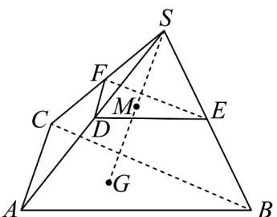

<!-- question-source:start -->
13. 如图，在三棱锥 $S - ABC$ 中，点 $G$ 为底面 $\mathrm{V}ABC$ 的重心，点 $M$ 是线段 $SG$ 的中点，过点 $M$ 的平面分别交 $SA, SB, SC$ 于点 $D, E, F$ ，若 $\overline{SD} = k\overline{SA}$ ， $\overline{SE} = m\overline{SB}$ ， $\overline{SF} = n\overline{SC}$ ，则 $\frac{1}{k} + \frac{1}{m} + \frac{1}{n} = (\quad)$

A.3 B.6 C.9 D.12
<!-- question-source:end -->

![[高中/课堂同步/题库/人教A版高中数学同步讲义(2026)/03_选择性必修第一册/第一章 空间向量与立体几何/专题02 空间向量基本定理及其坐标表示四大常考题型（高效培优专项训练）/题型二_用空间向量基本定理解决相关的几何问题/questions/answers/Q00079714A1.md]]
