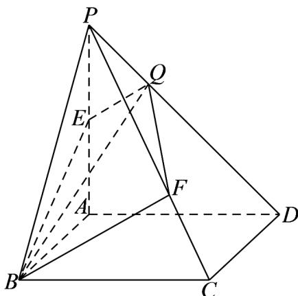

> [!faq]- 《专题02 空间向量基本定理及其坐标表示四大常考题型（高效培优专项训练）》官方解析
>
> > [!success]- **【答案】** C
>
> > [!note]- **【分析】**
> > 由共面向量的基本定理得出 $\overline{BQ}=mBE+nBF$ ，利用空间向量的减法可得出
> >
> > $PQ=\left(1-m-n\right)PB+\frac{1}{2}mPA+\frac{2}{3}nPC$ ，设 $PQ=kPD$ ，利用空间向量的线性运算得出 $PQ=kPA-kPB+kPC$ ，
> > 进而可得出关于 k、m、n 的方程组，解出 k 的值，即可得出 $\lambda$ 的值。
>
> > [!note]- **【解析】**
> > 如下图所示：
> >
> > 
> >
> > 因为 B、E、F、Q 四点共面，且 $\overset{\text{uuu}}{BE}$ 、 $\overset{\text{uuu}}{BF}$ 不共线，
> >
> > 则存在 $m$ 、 $n\in \mathbf{R}$ ，使得 $\overline{BQ} = m\overline{BE} +n\overline{BF}$
> >
> > 即 $PQ - PB = m\left(PE - PB\right) + n\left(PF - PB\right)$
> >
> > 所以 $PQ = (1 - m - n)PB + mPE + nPF = (1 - m - n)PB + \frac{1}{2}mPA + \frac{2}{3}nPC$ 因为四边形 ABCD 为平行四边形，所以 $\overline{AD} = \overline{BC}$ ，即 $\overline{PD} - \overline{PA} = \overline{PC} - \overline{PB}$ ，
> > 所以 $\overline{PD} = \overline{PA} - \overline{PB} + \overline{PC}$ 设 $PQ = kPD$ ，则 $PQ = kPA - kPB + kPC$ ，
> >
> > 因为 、 、 不共面，所以 $\left\{ \begin{array}{lll}1 - m - n = -k\\ \frac{1}{2} m = k & , & \text{解得} \\ \frac{2}{3} n = k & k = \frac{2}{5} & PQ = \frac{2}{5} PD \end{array} \right.$
> >
> > 又因为 $PQ = \lambda QD$ ，故 $\lambda = \frac{2}{3}$
> >
> > 故选 **C**.
