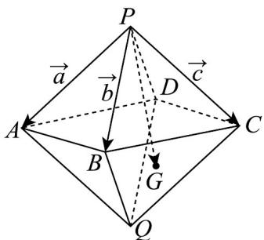
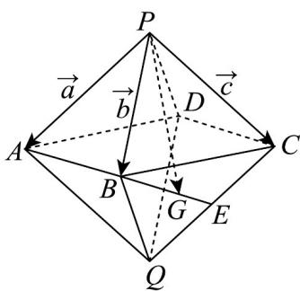

> [!faq]- 《专题02 空间向量基本定理及其坐标表示四大常考题型（高效培优专项训练）》官方解析
>
> > [!success]- **【答案】** A. $\frac{1}{6} a$ B. $\sqrt{6} m$ C. $\frac{\sqrt{6}\vec{m}}{6}$ D. $\frac{1}{6} m$
>
> > [!note]- **【分析】**
> > 根据空间向量的投影向量公式计算即可·
>
> > [!note]- **【解析】**
> > 因为 $\{a, b, c\}$ 是空间的一个单位正交基底，
> >
> > $$
> > a \cdot b = a \cdot c = b \cdot c = 0
> > $$
> >
> > $$
> > \binom {\mathrm{r}} {a} ^ {2} = \binom {\mathrm{r}} {b} ^ {2} = \binom {\mathrm{r}} {c} ^ {2} = 1
> > $$
> >
> > $$
> > \left| \mathbf {u} \right| ^ {2} = \left( \begin{array}{c c} \mathrm{r} & \mathrm{r} \\ a - b + 2 c \end{array} \right) ^ {2} = \binom {\mathrm{r}} {a} ^ {2} + \binom {\mathrm{r}} {b} ^ {2} + 4 \binom {\mathrm{r}} {c} ^ {2} = 6
> > $$
> >
> > $$
> > \begin{array}{l} \mathrm{r} \\ a \cdot \left( \begin{array}{c c c} \mathrm{r} & \mathrm{r} & \mathrm{r} \\ a - b + 2 c \end{array} \right) = \mathrm{r} _ {2} \\ a ^ {\prime} = 1 \end{array}
> > $$
> >
> > 所以空间向量 在 方向上的投影向量为 $\frac{\mathrm{r}\cdot\mathrm{u}}{\left|\mathrm{u}\right|^{2}}\cdot\mathrm{m}=\frac{\mathrm{r}\cdot\left(\mathrm{a}-\mathrm{b}+2\mathrm{c}\right)}{\left|\mathrm{u}\right|^{2}}\cdot\mathrm{m}=\frac{1}{6}\mathrm{u}$
> >
> > 故选：D
> >
> > 17．六氟化硫，化学式为 $SF_{6}$ ，常压下是一种无色、无臭、无毒、不燃的稳定气体，有良好的绝缘性，在电器工业方面具有广泛用途·六氟化硫分子结构为正八面体结构（正八面体每个面都是正三角形，可以看作是两个棱长均相等的正四棱锥将底面重合的几何体）·如图所示，在正八面体 P-ABCD-Q 中，G 是 $\triangle BCQ$ 的重心，记 PA=a，PB=b，PC=c，则 PG 等于（）
> >
> > 【答案】
> >
> > 
> >
> > A. $-\frac{1}{3} a + \frac{1}{3} b + \frac{2}{3} c$ B. $\frac{1}{3} a - \frac{1}{3} b + \frac{2}{3} c$ C. $\frac{1}{3} a - \frac{1}{3} b - \frac{2}{3} c$ D.
> >
> > $$
> > \frac {1}{3} a + \frac {1}{3} b + \frac {2}{3} c
> > $$
> >
> > 【答案】D
> > 【分析】由空间向量的线性运算求解即可·【详解】易知 $PD = BQ = a + c - b$ ，设 $CQ$ 中点为 $E$ ，
> >
> > 则 $\overrightarrow{BG} = \frac{2}{3}\overrightarrow{BE} = \frac{1}{3}\left(\overrightarrow{BQ} +\overrightarrow{BC}\right) = \frac{1}{3}\left(\overrightarrow{BQ} +\overrightarrow{PC} -\overrightarrow{PB}\right) = \frac{1}{3}\left(\overrightarrow{a} -2\overrightarrow{b} +2c\right)$
> >
> > 所以 $\overrightarrow{PG} = \overrightarrow{PB} + \overrightarrow{BG} = b + \frac{1}{3} (a - 2b + 2c) = \frac{1}{3} a + \frac{1}{3} b + \frac{2}{3} c$
> >
> > 
> >
> > 故选 **D**.
