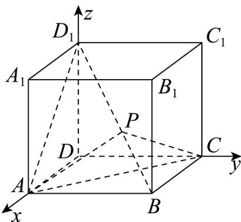

> [!faq]- 《专题02 空间向量基本定理及其坐标表示四大常考题型（高效培优专项训练）》官方解析
>
> > [!success]- **【答案】** C
>
> > [!note]- **【分析】**
> > 以点D为原点建立空间直角坐标系，由 $\angle APC$ 为钝角，可得 $\cos\angle APC=\cos\left\langle PA,PC\right\rangle<0$ ，得到不等式，解不等式，可得出答案
>
> > [!note]- **【解析】**
> > 如图，以点D为原点建立空间直角坐标系，
> >
> > 则 $A(1,0,0),B(1,1,0),C(0,1,0),D_{1}(0,0,1)$ $BA=(0,-1,0)$ ， $BD_{1}=(-1,-1,1)$ ， $BC=(-1,0,0)$ ，
> >
> > 故 $PA=BA-BP=BA-\lambda BD_{1}=(0,-1,0)-\lambda(-1,-1,1)=(\lambda,\lambda-1,-\lambda)$ ， $PC=BC-BP=BC-\lambda BD_{1}=(-1,0,0)-\lambda(-1,-1,1)=(\lambda-1,\lambda,-\lambda)$ ，
> >
> > 则 $\cos\angle APC=\cos\left\langle PA,PC\right\rangle=\frac{PA\cdot PC}{|PA||PC|}=\frac{\lambda(\lambda-1)+\lambda(\lambda-1)+\lambda^{2}}{\sqrt{\lambda^{2}+(\lambda-1)^{2}+\lambda^{2}}\cdot\sqrt{(\lambda-1)^{2}+\lambda^{2}+\lambda^{2}}}$ $=\frac{3\lambda^{2}-2\lambda}{3\lambda^{2}-2\lambda+1}<0$ ，
> >
> > 因为 $3\lambda^{2}-2\lambda+1=3\left(\lambda-\frac{1}{3}\right)^{2}+\frac{2}{3}>0$ ，
> >
> > 所以 $3\lambda^{2}-2\lambda<0$ ，解得 $0<\lambda<\frac{2}{3}$ ，
> >
> > 所以 $\lambda$ 的取值范围为 $\left(0,\frac{2}{3}\right)$ 。
> >
> > 
> >
> > 故选 **C**
