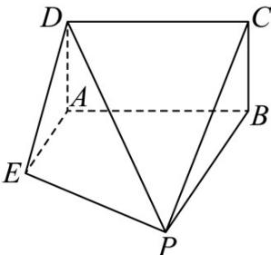

<!-- question-source:start -->
10．如图，已知矩形ABCD所在平面与直角梯形ABPE所在平面交于直线AB， $DE=\sqrt{2}$ 且AB=BP=2，
AD = AE = 1, AE ⊥ AB，且AE//BP·设点M为棱PD的中点，求证：EM//平面ABCD.

<!-- question-source:end -->

![[高中/课堂同步/题库/人教A版高中数学同步讲义(2026)/03_选择性必修第一册/第一章 空间向量与立体几何/专题03 空间向量的应用四大常考题型（高效培优专项训练）/题型一_利用向量研究平行问题/questions/answers/Q00079743A1.md]]
