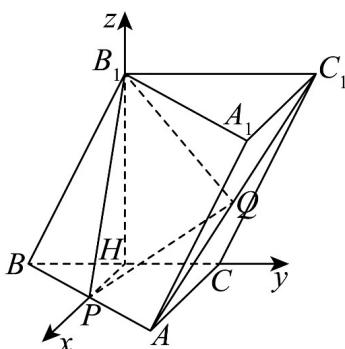

> [!faq]- 《专题03 空间向量的应用四大常考题型（高效培优专项训练）》官方解析
>
> > [!success]- **【答案】** 证明见解析
>
> > [!note]- **【分析】**
> > 以点 $H$ 为原点，建立空间直角坐标系，得到向量 $\overline{PQ} = (0,3,\sqrt{3})$ 和平面 $BCC_{1}B_{1}$ 的法向量为 $\overline{n_1} = (1,0,0)$ ，求得 $\overline{PQ}\cdot \overline{n_1} = 0$ ，得到 $\overline{PQ}\perp \overline{n_1}$ ，进而证得 $PQ / /$ 平面 $BCC_{1}B_{1}$ ；
>
> > [!note]- **【解析】**
> > 证明：如图，
> >
> > 
> >
> > 因为 H, P 分别是 BC, AB 的中点, 所以 HP // AC,
> >
> > 因为 $AC \perp BC$ ，可得 $HP \perp BC$ ，又因为 $B_{1}H \perp$ 平面 ABC，
> >
> > 以点 H 为原点，以 HP, HC, $HB_{1}$ 所在直线分别为 x 轴，y 轴和 z 轴，建立空间直角坐标系，
> >
> > 如图所示，可得 $H(0,0,0)$ ， $A(4,2,0)$ ， $C(0,2,0)$ ， $B(0,-2,0)$ ， $B_{1}(0,0,2\sqrt{3})$ ， $C_1(0,4,2\sqrt{3})$ ， $P(2,0,0)$ ， $Q(2,3,\sqrt{3})$
> >
> > 所以向量 $PQ = (0,3,\sqrt{3})$ ，且平面 $BCC_{1}B_{1}$ 的法向量为 $\overline{n_1} = (1,0,0)$
> >
> > 则 $PQ \cdot n_{1} = 0$ ，所以 $PQ \perp n_{1}$
> >
> > 又因为 $PQ \not\subset$ 平面 $BCC_{1}B_{1}$ ，所以 $PQ \parallel$ 平面 $BCC_{1}B_{1}$ .
