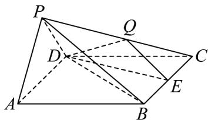

<!-- question-source:start -->
29. 如图，在四棱锥 $P - ABCD$ 中，平面 $PAD \perp$ 平面 $ABCD$ ，底面 $ABCD$ 是边长为 2 的菱形， $\angle BAD = 60^{\circ}$ ， $PA = PD = \sqrt{2}$ ， $E$ 是 $BC$ 的中点，点 $Q$ 在侧棱 $PC$ 上·

(1)求证： $AD\bot PB$

(2)是否存在点 $Q$ ，使 $DC$ 与平面 $DEQ$ 所成角的正弦值为 $\frac{\sqrt{5}}{5}$ ，若存在，求 $\frac{PQ}{PC}$ 的值；若不存在，请说明理由·
<!-- question-source:end -->

![[高中/课堂同步/题库/人教A版高中数学同步讲义(2026)/03_选择性必修第一册/第一章 空间向量与立体几何/专题03 空间向量的应用四大常考题型（高效培优专项训练）/题型三_线面角/questions/answers/Q00079758A1.md]]
