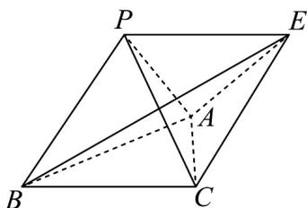
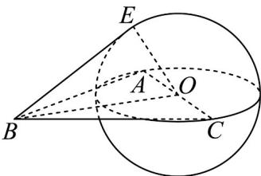

> [!faq]- 《专题03 空间向量的应用四大常考题型（高效培优专项训练）》官方解析
>
> > [!success]- **【答案】** D
>
> > [!note]- **【分析】**
> > 在平面 PBC 中过 C 作 CE // BP, CE = BP，连接 BE，根据题设中的数量积可得 E 的轨迹为以 AC 为直径的球面，故可求 $\overline{BC} + \overline{BP}$ 与平面 ABC 所成角正切值的最大值.
>
> > [!note]- **【解析】**
> > 
> >
> > 在平面 $PBC$ 中过 $C$ 作 $CE // BP, CE = BP$ ，连接 $BE$ ，
> >
> > 则四边形 $BCEP$ 为平行四边形，且 $\overline{BP} + \overline{BC} = \overline{BE}$ ，
> >
> > 故 $\overline{BC} + \overline{BP}$ 与平面 $ABC$ 所成角即为 $\overline{BE}$ 与平面 $ABC$ 所成的角.
> >
> > 而 $\overline{BP} \cdot BC = \overline{BP} \cdot (\overline{BA} - \overline{BP})$ ，故 $\overline{BP} \cdot (\overline{BC} - \overline{BA} + \overline{BP}) = 0$ ，
> >
> > 故 $\overline{BP} \cdot (\overline{AC} + \overline{BP}) = 0$ 即 $\overline{CE} \cdot (\overline{AC} + \overline{CE}) = 0$ 即 $\overline{CE} \cdot AE = 0$ ，故 $CE \perp AE$
> >
> > $$
> > \mathrm{V} A B C
> > $$
> >
> > 则 E 的轨迹为以 AC 为直径的球面（除去平面 ABC 中以 AC 为直径的圆），如图，设 O 为 AC 的中点，连接 OE, OB，
> >
> > 
> >
> > 当 $E$ 在球面上且平面 $BOE \perp$ 平面 $ABC$ 时， $BE$ 与平面 $ABC$ 所成的角最大且为 $\angle EBO$ ，此时 $BE \perp OE, OE = \frac{1}{2} AC = 2, BO = \sqrt{3}$ ，故 $BE = \sqrt{2}$ ，故此时 $\tan \angle EBO = \frac{\sqrt{2}}{2}$ ，
> >
> > 故选 **D**.
