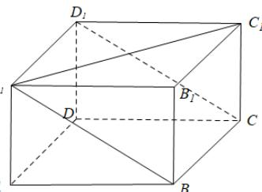
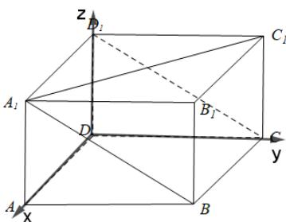

> [!faq]- 《专题03 空间向量的应用四大常考题型（高效培优专项训练）》官方解析
>
> > [!success]- **【答案】**  A. $\frac{5}{3}$ B. $\frac{3}{2}$ C. $\frac{5}{2}$ D. $\frac{1}{8}$
>
> > [!note]- **【分析】**
> > 根据题意建立空间直角坐标系，用向量法即可求出底面边长，即可求解
>
> > [!note]- **【解析】**
> > 
> >
> > 如图所示，以 D 为坐标原点，建立空间直角坐标系，
> > 设底面正方形 ABCD 边长为 a，
> > 则 $A_{1}(a,0,0)$ , $C(0,a,0)$ , $D_{1}(0,0,1)$ , $C_{1}(0,a,1)$
> >
> > 则 $A_{1}C_{1} = (-a,a,0),D_{1}A_{1} = (a,0,0),D_{1}C = (0,a, - 1)$
> >
> > 设平面 $A_{1}BCD_{1}$ 的法向量为 $n = (x, y, z)$
> >
> > 则 $\left\{ \begin{array}{l} n \cdot D_{1}A_{1} = 0 \\ \rightarrow D_{1}C = 0 \end{array} \right. \Rightarrow \left\{ \begin{array}{l} ax = 0 \\ ay - z = 0 \end{array} \right.$ ，可取 $n = (0,1,a)$ ，
> >
> > 所以 $n \cdot A_{1}C_{1} = a, \left|n\right| = \sqrt{1 + a^{2}}, \left|A_{1}C_{1}\right| = \sqrt{2}a$
> >
> > 因直线 $A_{1}C_{1}$ 与平面 $A_{1}BCD_{1}$ 所成角的余弦值为 $\frac{2\sqrt{5}}{5}$
> >
> > 故直线 $A_{1}C_{1}$ 与平面 $A_{1}BCD_{1}$ 所成角的正弦值为 $\frac{\sqrt{5}}{5}$
> >
> > 所以 $\left|\cos\left\langle n,A_{1}C_{1}\right\rangle\right|=\frac{\left|n\cdot A_{1}C_{1}\right|}{\left|n\right|\left|A_{1}C_{1}\right|}=\frac{a}{\sqrt{2}a\cdot\sqrt{1+a^{2}}}=\frac{\sqrt{5}}{5}$ ，解得 $a^{2}=\frac{3}{2}$
> >
> > 故正四棱柱的体积为 $a^2 \times 1 = \frac{3}{2}$
> >
> > 故选 **B**.
