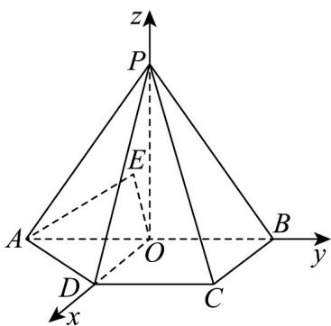

> [!faq]- 《专题03 空间向量的应用四大常考题型（高效培优专项训练）》官方解析
>
> > [!success]- **【答案】** D
>
> > [!note]- **【分析】**
> > 证明 $PO \perp$ 平面 $ABCD$ ， $ODCB$ 是正方形，以 $O$ 为原点， $OD, OB, OP$ 分别为 $x, y, z$ 轴建立如图所示的空间直角坐标系，设 $E(x, 0, z)$ ，利用空间向量法求线面角从而得出 $x, z$ 满足的关系，再计算 $\left|OE\right|$ ，结合
> >
> > 函数知识得最小值.
>
> > [!note]- **【解析】**
> > $\angle ABC = \angle BCD = 90^{\circ}$ ，则 $AB // CD$ ，又 $DO // BC$ ，
> >
> > 所以 $DCBO$ 是矩形，因为 $AB = 2$ ， $DC = BC = 1$ ，所以 $DO = BC = CD = OB$ ，即 $DOBC$ 是正方形，
> >
> > 从而 $O$ 是 $AB$ 中点，而 $PA = PB$ ，所以 $PO \perp AB$ ， $PO = \sqrt{2^2 - 1^2} = \sqrt{3}$
> >
> > 因为平面 $PAB \perp$ 平面 ABCD ，平面 $PAB \cap$ 平面 ABCD = AB ， $PO \subset$ 平面 PAB ，
> >
> > 所以 $PO \perp$ 平面 ABCD ，
> >
> > 以 $O$ 为原点， $OD, OB, OP$ 分别为 $x, y, z$ 轴建立空间直角坐标系，如图，
> >
> > 则 $A(0, - 1,0)$ ， $B(0,1,0)$ ， $C(1,1,0)$ ， $P(0,0,\sqrt{3})$
> >
> > 设 $E(x,0,z)$ ，则 $\overline{AE} = (x,1,z)$ ， $\overline{PB} = (0,1, - \sqrt{3}),\overline{BC} = (1,0,0)$
> >
> > 设平面 $PBC$ 的一个法向量是 $n = (a, b, c)$
> >
> > 则 $\left\{ \begin{array}{l} n \cdot PB = b - \sqrt{3}c = 0 \\ n \cdot BC = a = 0 \end{array} \right.$ ，取 $c = 1$ ，得 $n = (0,\sqrt{3},1)$
> >
> > 因为直线 $AE$ 与平面 $PBC$ 所成的角为 $\frac{\pi}{6}$
> >
> > 所以 $\left|\cos AE, n\right| = \frac{\left|\overrightarrow{AE} \cdot \overrightarrow{n}\right|}{\left|\overrightarrow{AE}\right|\left|n\right|} = \frac{\left|\sqrt{3} + z\right|}{\sqrt{x^{2} + 1 + z^{2}} \cdot 2} = \sin \frac{\pi}{6} = \frac{1}{2}$ ，化简得 $x^{2} = 2\sqrt{3}z + 2$ ，
> >
> > 由 $x^{2} = 2\sqrt{3} z + 2$ 0得 $\frac{\sqrt{3}}{3}$
> >
> > $\left|OE\right|=\sqrt{x^{2}+z^{2}}==\sqrt{z^{2}+2\sqrt{3}z+2}=\sqrt{(z+\sqrt{3})^{2}-1}$ 在 z $-\frac{\sqrt{3}}{3}$ 时是增函数，
> >
> > 所以 $z = -\frac{\sqrt{3}}{3}$ 时， $\left|\overrightarrow{OE}\right|_{\min} = \frac{\sqrt{3}}{3}$
> >
> > 故选：D.
> >
> > 
