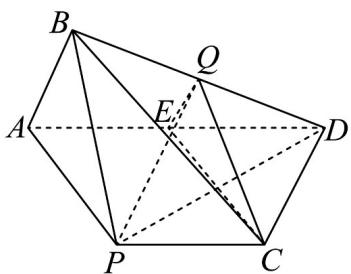
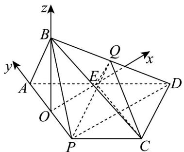

> [!faq]- 《专题03 空间向量的应用四大常考题型（高效培优专项训练）》官方解析
>
> > [!success]- **【答案】** (1)证明过程见解析 (2)证明过程见解析 (3) $\frac{\sqrt{2}}{3}$
>
> > [!note]- **【分析】**
> > （1）只需证明 $PD \perp AB$ ， $AB \perp BP$ ，再结合线面垂直的判定定理即可得证；
> >
> > (2) 取取 AD 中点 E，连接 QE, CE，只需证明平面 $QEC \parallel$ 平面 PAB，再结合面面平行的性质定理即可得证；
> >
> > (3) 建立适当的空间直角坐标系，求出直线 $PQ$ 的法向量与平面 $PBC$ 的法向量，由向量夹角的余弦公式即可求解：
>
> > [!note]- **【解析】**
> > （1）因为在矩形ABCD中，AD=2AB=2，P是BC的中点，
> >
> > 所以 $AP = PD = \sqrt{2}$ ，即 $AP^2 +PD^2 = AD^2$ ，所以 $PD\bot AP$
> >
> > 又因为平面 $PAB \perp$ 平面 $APCD$ ，平面 $PAB \cap$ 平面 $APCD = PA$ ， $PA \subset$ 平面 $APCD$
> >
> > 所以 $PD \perp$ 平面 PAB ，
> >
> > 又 $AB \subset$ 平面 PAB ，所以 $PD \perp AB$
> >
> > 又因为 $AB \perp BP$ ， $PB \cap PD = P$ ， $PB, PD \subset$ 平面 $PBD$
> >
> > 所以 $AB \perp$ 平面 PBD；
> >
> > (2) 如图所示，取 AD 中点 E，连接 QE, CE
> >
> > 
> >
> > 因为在矩形 ABCD 中，AD = 2AB = 2，P 是 BC 的中点，
> >
> > 所以 $AE / / PC, AE = PC$ ，即四边形 $AECP$ 为平行四边形，
> >
> > 从而 $AP // CE$ ，又因为 $CE \notin$ 平面 $PAB$ ， $PA \subset$ 平面 $PAB$ ，
> >
> > 所以 $CE / /$ 平面 $PAB$
> >
> > 又因为 $Q, E$ 分别是 $DB, DA$ 的中点，
> >
> > 所以 $QE \parallel AB$
> >
> > 又因为 $QE \notin$ 平面 $PAB$ ， $AB \subset$ 平面 $PAB$
> >
> > 所以 $QE / /$ 平面PAB
> >
> > 又因为 $QE \cap EC = E, QE, EC \subset$ 平面 $QEC$
> >
> > 所以平面 $QEC \parallel$ 平面PAB，
> >
> > 又因为 $CQ \subset$ 平面 QEC ，所以 $CQ \parallel$ 平面 PAB ；
> >
> > (3) 取 PA 中点 O，因为 AB = BP，所以 OB ⊥ AP
> >
> > 又因为平面 $PAB \perp$ 平面 APCD，平面 $PAB \cap$ 平面 APCD = PA，OB ⊂ 平面 PAB，
> >
> > 所以 $BO \perp$ 平面 APCD
> >
> > 又因为 $OE, OA \subset$ 平面 APCD ，所以 $BO \perp OE, BO \perp OA$
> >
> > 又因为 $PA \perp PD, OE // PD$ ，所以 $PA \perp OE$
> >
> > 所以 OE, OA, OB 两两互相垂直，
> >
> > 以点 $O$ 为原点， $OE, OA, OB$ 所在直线分别为 $x, y, z$ 轴，建立如图所示的空间直角坐标系，
> >
> > 
> >
> > 由题意 $O(0,0,0), A\left(0, \frac{\sqrt{2}}{2}, 0\right), P\left(0, -\frac{\sqrt{2}}{2}, 0\right), B\left(0, 0, \frac{\sqrt{2}}{2}\right), E\left(\frac{\sqrt{2}}{2}, 0, 0\right)$ ，
> >
> > 设 $C(x_{1},y_{1},z_{1}), D(x_{2},y_{2},z_{2})$
> >
> > 因为四边形 $AECP$ 为平行四边形，所以 $\vec{EC} = \left(x_{1} - \frac{\sqrt{2}}{2},y_{1},z_{1}\right),\vec{AP} = (0, - \sqrt{2},0)$
> >
> > 即 $\left(x_{1} - \frac{\sqrt{2}}{2},y_{1},z_{1}\right) = (0, - \sqrt{2},0)$ ，所以 $x_{1} - \frac{\sqrt{2}}{2} = 0,y_{1} = -\sqrt{2},z_{1} = 0$
> >
> > 故 $(x_{1},y_{1},z_{1}) = \left(\frac{\sqrt{2}}{2}, - \sqrt{2},0\right)$
> >
> > 又因为 $\overrightarrow{AD}=\left(x_{2},y_{2}-\frac{\sqrt{2}}{2},z_{2}\right)=2\overrightarrow{PC}=2\left(\frac{\sqrt{2}}{2},-\frac{\sqrt{2}}{2},0\right)=\left(\sqrt{2},-\sqrt{2},0\right)$
> >
> > 解得 $(x_{2},y_{2},z_{2}) = \left(\sqrt{2}, - \frac{\sqrt{2}}{2},0\right)$
> >
> > 又因为 $Q$ 是 $BD$ 中点，
> >
> > 所以 $C\left(\frac{\sqrt{2}}{2}, - \sqrt{2},0\right),D\left(\sqrt{2}, - \frac{\sqrt{2}}{2},0\right),Q\left(\frac{\sqrt{2}}{2}, - \frac{\sqrt{2}}{4},\frac{\sqrt{2}}{4}\right)$
> >
> > 所以 $\overrightarrow{PQ} = \left(\frac{\sqrt{2}}{2},\frac{\sqrt{2}}{4},\frac{\sqrt{2}}{4}\right),\overrightarrow{PB} = \left(0,\frac{\sqrt{2}}{2},\frac{\sqrt{2}}{2}\right),\overrightarrow{PC} = \left(\frac{\sqrt{2}}{2}, - \frac{\sqrt{2}}{2},0\right)$
> >
> > 设平面 PBC 的一个法向量为 $n = \left(x_{0}, y_{0}, z_{0}\right)$ ,
> >
> > 则 $\left\{ \begin{array}{l} \rightarrow \square \square \square \\ n \cdot PB = \frac{\sqrt{2}}{2} y_0 + \frac{\sqrt{2}}{2} z_0 = 0 \\ \rightarrow \square \square \square \\ n \cdot PC = \frac{\sqrt{2}}{2} x_0 - \frac{\sqrt{2}}{2} y_0 = 0 \end{array} \right.$ ，令，解得，
> >
> > 所以平面 PBC 的法向量为 $n = (1, 1, -1)$ ,
> >
> > 故所求为 $\frac{\left|\begin{matrix}\vec{PQ}\cdot\vec{n}\\ \vec{PQ}\end{matrix}\right|}{\left|\begin{matrix}PQ\end{matrix}\right|\cdot|n|}=\frac{\left|\frac{\sqrt{2}}{2}+\frac{\sqrt{2}}{4}-\frac{\sqrt{2}}{4}\right|}{\sqrt{\frac{1}{2}+\frac{1}{8}+\frac{1}{8}}\cdot\sqrt{3}}=\frac{\sqrt{2}}{3}.$
