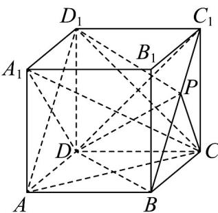
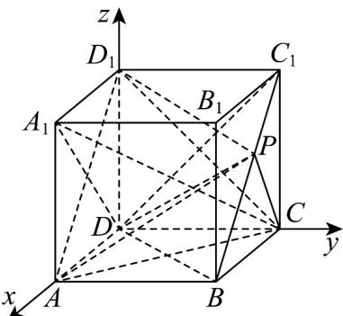

## 题型三：线面角

21. 正方体 $ABCD - A_1B_1C_1D_1$ 中，点 $P$ 为线段 $BC_{1}$ 上的动点，则下列结论正确的是（）A. $A_{1}C \perp DP$ B. 三棱锥 $A - D_{1}PC$ 的体积为定值 C. 直线 $AP$ 与平面 $ACD_{1}$ 所成角的取值范围为 $[\frac{\pi}{6}, \frac{\pi}{3}]$ D. 直线 $AP$ 与直线 $A_{1}D$ 所成的角为定值

【答案】ABD

【分析】对于 A，先由线线垂直证 $DC_{1} \perp$ 平面 $A_{1}CD_{1}$ ，得到 $DC_{1} \perp A_{1}C$ ，同理证得 $DB \perp A_{1}C$ ，从而得 $A_{1}C \perp$ 平面 $DBC_{1}$ ，即可证 $A_{1}C \perp DP$ ；对于 B，由 $BC_{1} //$ 平面 $ACD_{1}$ 得到点 P 到平面 $ACD_{1}$ 的距离不变，结合底面 $^{\triangle}ACD_{1}$ 面积为定值即得；对于 C，D，通过建系利用空间向量夹角公式，分别计算线面所成角和异面直线所成角推理即得结论。

【详解】

对于 $A$ ，在正方体 $ABCD - A_1B_1C_1D_1$ 中， $A_1D_1 \perp$ 平面 $DCC_1D_1$ ， $DC_1 \subset$ 平面 $DCC_1D_1$ ，则 $A_1D_1 \perp DC_1$ ，因 $DC_1 \perp D_1C$ ， $A_1D_1 \cap D_1C = D_1, A_1D_1, D_1C \subset$ 平面 $A_1CD_1$ ，故 $DC_1 \perp$ 平面 $A_1CD_1$ ，因 $A_1C \subset$ 平面 $A_1CD_1$ ，故 $DC_1 \perp A_1C$ ，同理可得 $DB \perp A_1C$ ，因 $DB \cap DC_1 = D, DB, DC_1 \subset$ 平面 $DBC_1$ ，则 $A_1C \perp$ 平面 $DBC_1$ ，又点 $P$ 为线段 $BC_1$ 上的动点，即 $DP \subset$ 平面 $DBC_1$ ，故 $A_1C \perp DP$ ，故 $A$ 正确；对于 $B$ ，易证 $BC_1 // AD_1$ ，因 $BC_1 \notin$ 平面 $ACD_1$ ， $AD_1 \subset$ 平面 $ACD_1$ ，故 $BC_1 //$ 平面 $ACD_1$ ，则点 $P$ 到平面 $ACD_1$ 的距离不变，又 $\triangle ACD_1$ 的面积为定值，故三棱锥 $A - D_1PC$ 的体积为定值，故 $B$ 正常

对于 $C$ ，如图建立空间直角坐标系 $D - xyz$ ，设正方体的棱长为1，则 $A(1,0,0),C(0,1,0),D_{1}(0,0,1),B(1,1,0),C_{1}(0,1,1)$

因点 P 为线段 $BC_{1}$ 上的动点，设 $\overline{BP}=t\overline{BC}_{1}=(-t,0,t)$ ， $0\leq t\leq1$ ，则 $\overline{AP}=\overline{AB}+\overline{BP}=(0,1,0)+(-t,0,t)=(-t,1,t)$

因 $AD_{1} = (-1,0,1), AC = (-1,1,0)$ ，设平面 $ACD_{1}$ 的法向量为 $n = (x,y,z)$

则 $\left\{ \begin{array}{l} AD_{1} \cdot n = -x + z = 0 \\ AC \cdot n = -x + y = 0 \end{array} \right.$ ，故可取 $n = (1,1,1)$

设直线 $_{AP}$ 与平面 $ACD_{1}$ 所成角为 $\theta$ ，则 $\sin\theta=|\cos\langle AP,n\rangle|=\frac{|-t+1+t|}{\sqrt{3}\cdot\sqrt{2t^{2}+1}}=\frac{\sqrt{3}}{3}\times\frac{1}{\sqrt{2t^{2}+1}}$ 因 $y = \frac{1}{\sqrt{2t^{2} + 1}}$ 在 $t \in [0,1]$ 上单调递减，故 $\frac{\sqrt{3}}{3} \leq \frac{1}{\sqrt{2t^{2} + 1}} \leq 1$ ，故得 $\sin \theta \in [\frac{1}{3}, \frac{\sqrt{3}}{3}]$ ，故 C 错误；
对于 D，根据 C 项建系，可得 $AP = (-t, 1, t)$ ， $A_{1}D = (-1, 0, -1)$ ，设直线 AP 与直线 $A_{1}D$ 所成的角为 $\alpha$ ，
则 $\cos\alpha=|\cos\langle AP,A_{1}D\rangle|=\frac{|t+0-t|}{\sqrt{2}\cdot\sqrt{2t^{2}+1}}=0$ ，即 $AP\perp A_{1}D$ ，故 D 正确.
故选：ABD.

![[高中/课堂同步/题库/人教A版高中数学同步讲义(2026)/03_选择性必修第一册/第一章 空间向量与立体几何/专题03 空间向量的应用四大常考题型（高效培优专项训练）/题型三_线面角/questions/Q00079752.md]]
![[高中/课堂同步/题库/人教A版高中数学同步讲义(2026)/03_选择性必修第一册/第一章 空间向量与立体几何/专题03 空间向量的应用四大常考题型（高效培优专项训练）/题型三_线面角/questions/Q00079753.md]]
![[高中/课堂同步/题库/人教A版高中数学同步讲义(2026)/03_选择性必修第一册/第一章 空间向量与立体几何/专题03 空间向量的应用四大常考题型（高效培优专项训练）/题型三_线面角/questions/Q00079754.md]]
![[高中/课堂同步/题库/人教A版高中数学同步讲义(2026)/03_选择性必修第一册/第一章 空间向量与立体几何/专题03 空间向量的应用四大常考题型（高效培优专项训练）/题型三_线面角/questions/Q00079755.md]]
![[高中/课堂同步/题库/人教A版高中数学同步讲义(2026)/03_选择性必修第一册/第一章 空间向量与立体几何/专题03 空间向量的应用四大常考题型（高效培优专项训练）/题型三_线面角/questions/Q00079756.md]]
![[高中/课堂同步/题库/人教A版高中数学同步讲义(2026)/03_选择性必修第一册/第一章 空间向量与立体几何/专题03 空间向量的应用四大常考题型（高效培优专项训练）/题型三_线面角/questions/Q00079757.md]]
![[高中/课堂同步/题库/人教A版高中数学同步讲义(2026)/03_选择性必修第一册/第一章 空间向量与立体几何/专题03 空间向量的应用四大常考题型（高效培优专项训练）/题型三_线面角/questions/Q00079758.md]]
![[高中/课堂同步/题库/人教A版高中数学同步讲义(2026)/03_选择性必修第一册/第一章 空间向量与立体几何/专题03 空间向量的应用四大常考题型（高效培优专项训练）/题型三_线面角/questions/Q00079759.md]]
