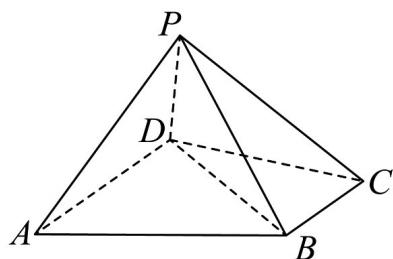

<!-- question-source:start -->
18. 如图，四棱锥 $P - ABCD$ 中， $BC // AD$ ， $AD = CD = 2BC = 2$ ，平面 $PAD \perp$ 平面 $PBC$ .

(1)若 $PB \perp BC$ ，证明： $AP \perp BP$ ；

(2)若 $PA \perp PC$ ， $\angle BCD = \frac{\pi}{3}$ ，求 $PA$ 长度的取值范围.
<!-- question-source:end -->

![[高中/课堂同步/题库/人教A版高中数学同步讲义(2026)/03_选择性必修第一册/第一章 空间向量与立体几何/专题03 空间向量的应用四大常考题型（高效培优专项训练）/题型二_利用向量研究垂直问题/questions/answers/Q00079749A1.md]]
