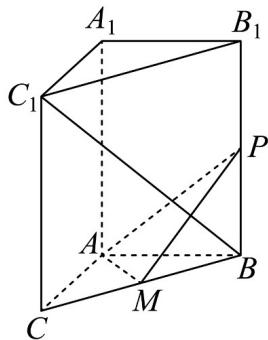

<!-- question-source:start -->
19. 如图，在三棱柱 $ABC - A_{1}B_{1}C_{1}$ 中， $AA_{1} \perp$ 底面 $ABC$ ， $\angle CAB = 90^{\circ}$ ， $AB = AC = 2$ ， $AA_{1} = 3$ ， $M$ 为 $BC$

的中点，P 为侧棱 $BB_{1}$ 上的动点·

(1)求证：平面 $AMP \perp$ 平面 $BB_{1}C_{1}C$

(2)试判断是否存在 P，使得直线 $BC_{1} \perp AP$ · 若存在，求 PB 的长；若不存在，请说明理由·
<!-- question-source:end -->

![[高中/课堂同步/题库/人教A版高中数学同步讲义(2026)/03_选择性必修第一册/第一章 空间向量与立体几何/专题03 空间向量的应用四大常考题型（高效培优专项训练）/题型二_利用向量研究垂直问题/questions/answers/Q00079750A1.md]]
