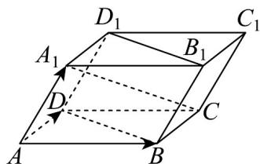

<!-- question-source:start -->
20. 如图，在平行六面体 $ABCD - A_1B_1C_1D_1$ 中， $AB = AD = AA_1 = 1$ ， $\angle A_1AB = \angle A_1AD = \angle BAD = 60^\circ$ .

(1)求 $AC_{1}$ 的长；

(2)求证：直线 $A_{1}C \perp$ 平面 $BDD_{1}B_{1}$ .
<!-- question-source:end -->

![[高中/课堂同步/题库/人教A版高中数学同步讲义(2026)/03_选择性必修第一册/第一章 空间向量与立体几何/专题03 空间向量的应用四大常考题型（高效培优专项训练）/题型二_利用向量研究垂直问题/questions/answers/Q00079751A1.md]]
