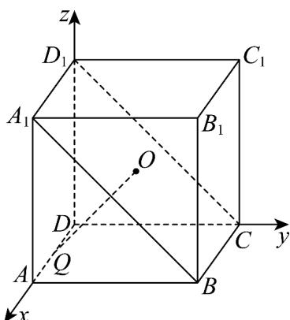
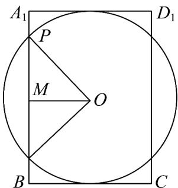

> [!faq]- 《专题03 空间向量的应用四大常考题型（高效培优专项训练）》官方解析
>
> > [!success]- **【答案】** B
>
> > [!note]- **【分析】**
> > 根据点 $P$ 满足的方程求得点 $P$ 的轨迹，结合球的性质求得 $PO = \sqrt{2}$ ，然后利用直角三角形求出两圆弧所对的圆心角，即可求解点 $P$ 的轨迹长度·
>
> > [!note]- **【解析】**
> > 由 $y + z - 2 = 0$ 知，点 $P$ 在四边形 $A_{1}BCD_{1}$ 内（含边界），由 $(x - 1)^{2} + y^{2} + z^{2} = 4$ 知，点 $P$ 在以 $AD$ 的中点 $Q$ 为球心， $2$ 为半径的球面上，所以点 $P$ 的轨迹为球被四边形 $A_{1}BCD_{1}$ 截得的圆弧，
> >
> > 取 $A_{1}C$ 的中点 $O$ ，则 $Q(1,0,0), A_{1}(2,0,2), D_{1}(0,0,2), B(2,2,0), C(0,2,0), O(1,1,1)$ ，则 $A_{1}B = (0,2,-2), A_{1}D_{1} = (-2,0,0), OQ = (0,-1,-1)$ ，因为 $A_{1}B \cdot OQ = 2 \times (-1) + (-2) \times (-1) = 0, A_{1}D_{1} \cdot OQ = (-2) \times 0 + 0 \times (-1) + 0 \times (-1) = 0$ ，所以 $OQ \perp A_{1}B, OQ \perp A_{1}D_{1}$ ，又 $A_{1}B \cap A_{1}D_{1} = A_{1}, A_{1}B, A_{1}D_{1} \subset$ 平面 $A_{1}BCD_{1}$ ，所以 $QO \perp$ 平面 $A_{1}BCD_{1}$ ， $PO \subset$ 平面 $A_{1}BCD_{1}$ ，所以 $QO \perp PO$ ，又 $PQ = 2, QO = \sqrt{2}$ ，则 $PO = \sqrt{2}$ ，
> >
> > 
> >
> > 在四边形 $A_{1}BCD_{1}$ 中，点 P 的轨迹为以 O 为圆心 $PO = \sqrt{2}$ 为半径，
> > 落在 $A_{1}BCD_{1}$ 内的两段圆弧，且 $A_{1}B = 2\sqrt{2}, A_{1}D_{1} = 2$ ，如图，
> >
> > 
> >
> > 取 $M$ 为 $A_{1}B$ 的中点，则 $OM \perp A_{1}B$ ， $OM = \frac{1}{2} A_{1}D_{1} = 1$ ， $PO = \sqrt{2}$ ，所以 $\cos \angle POM = \frac{1}{\sqrt{2}} = \frac{\sqrt{2}}{2}$ ，所以 $\angle POM = \frac{\pi}{4}$ ，所以 $\angle POB = 2\angle POM = \frac{\pi}{2}$ ，所以点 $P$ 的轨迹长度为 $\sqrt{2}\left(2\pi - 2 \times \frac{\pi}{2}\right) = \sqrt{2}\pi$ 。
> >
> > 故选 **B**
