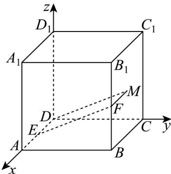

> [!faq]- 《专题03 空间向量的应用四大常考题型（高效培优专项训练）》官方解析
>
> > [!success]- **【答案】**  A．存在点P，使得 $\left|A_{1}P\right|=2\sqrt{3}$ B．存在点P，使得 $A_{1}P\perp$ 平面ADF C．存在点P，使得DP//EF D．存在点P，使得 $B_{1}P=DP$
>
> > [!note]- **【分析】**
> > 建立空间直角坐标系，利用坐标验证垂直判断 $^{A}$ ，由 $A_{1}P\perp DA$ ，得到方程组，找到符合题意的点，即可判断 $^{B}$ ，找出平行直线再由坐标判断是否垂直可判断 $^{C}$ ，设点的坐标根据条件列出方程组，即可判断D.
>
> > [!note]- **【解析】**
> > 如图，建立空间直角坐标系，
> >
> > 
> >
> > 则 $A_{1}(2,0,2),E(1,0,0),F(2,2,1),C(0,2,0),D(0,0,0),B_{1}(2,2,2)$
> >
> > 对于 $A$ ，由正方体性质知当 $P$ 在 $C$ 时，线段 $A_{1}P$ 长度的最大值为 $2\sqrt{3}$
> >
> > 此时 $A_{1}P = (-2,2, - 2),EF = (1,2,1)$ ， $A_{1}P\cdot EF = -2 + 4 - 2 = 0$
> >
> > 所以 $A_{1}P \perp EF$ ，即满足 $A_{1}P \perp EF$ ，即存在点 P，使得 $\left|A_{1}P\right| = 2\sqrt{3}$ ，故 A 正确；
> >
> > 对于 B：设 $P(x,y,z)$ ，则 $A_{1}^{UUU}P=(x-2,y,z-2)$ ， $EF=(1,2,1)$ ， $DA=(2,0,0)$
> >
> > 若 $A_{1}P \perp$ 平面 $ADF$ ，因为 $EF, DA \subset$ 平面 $ADF$ ，所以 $A_{1}P \perp DA$ ， $A_{1}P \perp EF$
> >
> > 即 $\left\{ \begin{array}{ll}A_{1}P\cdot EE = x - 2 + 2y + z - 2 = 0\\ A_{1}P\cdot DA = 2(x - 2) = 0 \end{array} \right.$ ，则 $\left\{ \begin{array}{ll}x = 2\\ 2y + z = 2 \end{array} \right.$ ，显然 $P(2,1,0)$ 满足题意，
> >
> > 故存在点 P，使得 $A_{1}P \perp$ 平面 ADF，故 B 正确；
> >
> > 对于 $\mathbb{C}$ ，取正方形 $BB_{1}C_{1}C$ 的中心 $M$ ，连接 $DM, MF$ ，易知 $MF // DE, MF = DE$
> >
> > 所以四边形 DMFE 为平行四边形，所以 DM//EF，故 P 运动到 M 处时，DP//EF，
> >
> > 此时 $P(1,2,1)$ ， $A_{1}P = (-1,2,-1)$ ， $A_{1}P \cdot EF = -1 + 4 - 1 = 2 \neq 0$ ，即不满足 $A_{1}P \perp EF$
> >
> > 综上不存在点 P，使得 DP//EF，故 C 错误；
> >
> > 对于 D，设 $P(x,y,z)$ ，则 $A_{1}P=(x-2,y,z-2)$ ， $EF=(1,2,1)$ ，若存在点 P，使得 $B_{1}P=DP$
> >
> > 由 $B_{1}P = DP$ ， $A_{1}P\perp EF$ ，可得方程组 $\left\{ \begin{array}{l}x - 2 + 2y + z - 2 = 0\\ \sqrt{(x - 2)^2 + (y - 2)^2 + (z - 2)^2} = \sqrt{x^2 + y^2 + z^2} \end{array} \right.$
> >
> > 化简可得 $\left\{ \begin{array}{l}x + 2y + z = 4\\ x + y + z = 3 \end{array} \right.$ ，解得 $\left\{ \begin{array}{l}x + z = 2\\ y = 1 \end{array} \right.$
> >
> > 显然当 $\left\{ \begin{array}{ll}x = 0\\ z = 2\\ y = 1 \end{array} \right.$ 时满足题意，即存在点，使得 $B_{1}P = DP$ ，故D正确；
> >
> > 故选 **C**
