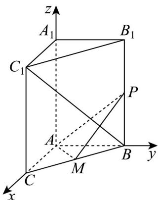

> [!faq]- 《专题03 空间向量的应用四大常考题型（高效培优专项训练）》官方解析
>
> > [!success]- **【答案】** (1)证明见解析 (2)存在， $\frac{4}{3}$
>
> > [!note]- **【分析】**
> > （1）由条件证明 $AM \perp BB_{1}$ ， $AM \perp BC$ ，结合线面垂直判定定理证明 $AM \perp$ 平面 $BB_{1}C_{1}C$ ，再由
> > 面面垂直判定定理证明结论；
> >
> > (2) 建立空间直角坐标系，设 $BP = t (0 \leq t \leq 3)$ ，求向量 $BC_{1}$ ，AP 的坐标，由条件列方程求 t 即可.
>
> > [!note]- **【解析】**
> > （1）∵ 在三棱柱 $ABC-A_{1}B_{1}C_{1}$ 中， $BB_{1}\perp$ 底面 ABC， $AM\subset$ 平面 ABC
> >
> > $\therefore AM \perp BB_{1}$
> >
> > ∵ AB = AC = 2 ，M 为 BC 的中点，
> >
> > $$
> > A M \perp B C
> > $$
> >
> > $\therefore BC \cap BB_{1} = B, BC, BB_{1} \subset$ 平面 $BB_{1}C_{1}C$
> >
> > ∴ $AM \perp$ 平面 $BB_{1}C_{1}C$
> >
> > ∵ AM ⊂ 平面 APM
> >
> > ∴平面 $APM \perp$ 平面 $BB_{1}C_{1}C$ ;
> >
> > (2) 以 A 为原点，AC 为 x 轴，AB 为 y 轴， $AA_{1}$ 为 z 轴，建立空间直角坐标系，如图所示，
> >
> > 
> >
> > $B(0,2,0)$ $C_1(2,0,3)$ $A(0,0,0)$
> >
> > 设 $BP = t(0 \leq t \leq 3)$ ，则 $P(0,2,t)$ ， $BC_1 = (2, -2,3)$ ， $AP = (0,2,t)$
> >
> > 若 $BC_{1} \perp AP$ ，则 $BC_{1} \cdot AP = 0 - 4 + 3t = 0$ ，解得 $t = \frac{4}{3} < 3$ ，
> >
> > 所以存在 P，使得直线 $BC_{1} \perp AP$ ，此时 $PB = \frac{4}{3}$ .
