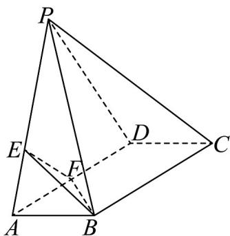

<!-- question-source:start -->
37. 如图，在四棱锥 $P - ABCD$ 中，平面 $PCD \perp$ 平面 $ABCD$ ，底面 $ABCD$ 是平行四边形， $AD = 2AB = 2$ ， $\angle BCD = 60^{\circ}$ ， $AB \perp AP$ ，点 $E$ 满足 $\overline{PE} = 2\overline{EA}$ ，点 $F$ 是线段 $AD$ 的中点。

(1)证明： $BD \perp$ 平面 PCD；

(2)若二面角 $E - BF - C$ 的大小为 $135^{\circ}$ 时，求四棱锥 $P - ABCD$ 的体积.
<!-- question-source:end -->

![[高中/课堂同步/题库/人教A版高中数学同步讲义(2026)/03_选择性必修第一册/第一章 空间向量与立体几何/专题03 空间向量的应用四大常考题型（高效培优专项训练）/题型四_二面角/questions/answers/Q00079765A1.md]]
