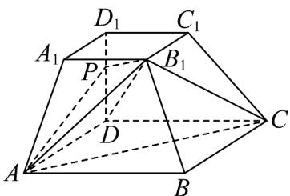

<!-- question-source:start -->
38. 如图，在底面为正方形的四棱台 $ABCD - A_1B_1C_1D_1$ 中，已知 $AB = 2A_1B_1 = 2$ ， $AA_1 = \sqrt{2}$ ， $DD_1 \perp AD$ ， $\angle B_1BA = \angle B_1BC$

(1)证明： $DD_{1} \perp$ 平面ABCD；

(2)点 $P$ 在棱 $DD_{1}$ 上，当二面角 $P - AB_{1} - C$ 的正弦值为 $\frac{3\sqrt{21}}{14}$ 时，求 $DP$
<!-- question-source:end -->

![[高中/课堂同步/题库/人教A版高中数学同步讲义(2026)/03_选择性必修第一册/第一章 空间向量与立体几何/专题03 空间向量的应用四大常考题型（高效培优专项训练）/题型四_二面角/questions/answers/Q00079766A1.md]]
