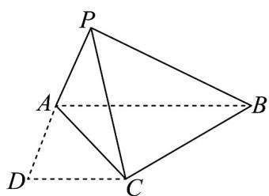

<!-- question-source:start -->
39. 如图，在梯形 $ABCD$ 中， $AB // CD$ ， $AD = DC = 2$ ， $AB = 4$ ，现将 $\triangle ADC$ 所在平面沿对角线 $AC$ 翻折，使点 $D$ 翻折至点 $P$ ，且成直二面角 $P - AC - B$ 。

(1)证明： $BC\perp$ 平面PAC；

(2)若异面直线 $PC$ 与 $AB$ 所成角的余弦值为 $\frac{1}{4}$ ，求平面 $BPA$ 与平面 $PAC$ 所成角的余弦值。
<!-- question-source:end -->

![[高中/课堂同步/题库/人教A版高中数学同步讲义(2026)/03_选择性必修第一册/第一章 空间向量与立体几何/专题03 空间向量的应用四大常考题型（高效培优专项训练）/题型四_二面角/questions/answers/Q00079767A1.md]]
