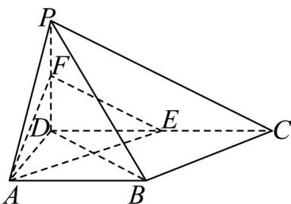

<!-- question-source:start -->
40．如图，在四棱锥 P-ABCD 中， $PD \perp$ 平面 ABCD， $AB // DC$ ， $AD \perp DC$ ，DA = AB = PD = 2，
DC = 4, E, F 分别为棱 CD, PD 的中点.

(1)求证： $PB / /$ 平面 $AEF$ ；

(2)求平面 PBD 与平面 CPB 的夹角的大小.
<!-- question-source:end -->

![[高中/课堂同步/题库/人教A版高中数学同步讲义(2026)/03_选择性必修第一册/第一章 空间向量与立体几何/专题03 空间向量的应用四大常考题型（高效培优专项训练）/题型四_二面角/questions/answers/Q00079768A1.md]]
