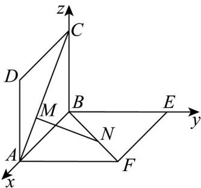

> [!faq]- 《专题03 空间向量的应用四大常考题型（高效培优专项训练）》官方解析
>
> > [!success]- **【答案】** 
>
> > [!note]- **【分析】**
> > 以 B 为坐标原点，BA, BE, BC 所在直线为坐标轴建立空间直角坐标系，利用坐标法可求得 $\left|MN\right|$ 的长及最小值，求出平面 MNA 与平面 MNB 的法向量，然后利用向量法求解二面角的平面角的余弦值即可.
>
> > [!note]- **【解析】**
> > 由题意两个边长均为 $^{1}$ 的正方形 ABCD 与正方形 ABEF 所在的平面互相垂直.
> >
> > 可得 $AB \perp BC, AB \perp BE, BC \perp BE$
> >
> > 以 $B$ 为坐标原点， $BA, BE, BC$ 所在直线为坐标轴建立如图所示的空间直角坐标系，
> >
> > 
> >
> > 则 $A(1,0,0),B(0,0,0),D(1,0,1),C(0,0,1),E(0,1,0),F(1,1,0)$
> >
> > 在 $xOz$ 平面上，直线 $AC$ 方程为 $x + z = 1$ ，可设 $M(t,0,1 - t)$
> >
> > 在 $xOy$ 平面上直线 $BF$ 方程为 $x - y = 0$ ，设 $CM = BN = a$ ，因此得 $N(t,t,0)$ ，由 $0 < a < \sqrt{2}$ 得 $0 < t < 1$ ，
> >
> > 则 $MN = (0, t, t - 1)$ ，所以 $MN = \left|MN\right| = \sqrt{t^{2} + (t - 1)^{2}} = \sqrt{2t^{2} - 2t + 1} = \sqrt{2(t - \frac{1}{2})^{2} + \frac{1}{2}}$ 当且仅当 $t=\frac{1}{2}$ 时，MN 取得最小值 $\frac{\sqrt{2}}{2}$ ，此时 M,N 分别是 AC,BF 的中点， $M(\frac{1}{2},0,\frac{1}{2})$ , $N(\frac{1}{2},\frac{1}{2},0)$ , $MN=(0,\frac{1}{2},-\frac{1}{2})$ , $MA=(\frac{1}{2},0,-\frac{1}{2})$ , $BN=(\frac{1}{2},\frac{1}{2},0)$ ,
> >
> > 设平面 MNA 的一个法向量 $n = (x, y, z)$ ，
> >
> > 则 $\left\{ \begin{array}{l} \vec{n} \cdot MN = \frac{1}{2} y - \frac{1}{2} z = 0 \\ \vec{n} \cdot MA = \frac{1}{2} x - \frac{1}{2} z = 0 \end{array} \right.$ ，取得 $x = 1$ $n = (1,1,1)$
> >
> > 设平面 $MNB$ 的一个法向量是 $\stackrel{\square}{p} = (x_1, y_1, z_1)$
> >
> > 则 $\left\{ \begin{array}{l} \vec{p} \cdot MN = \frac{1}{2} y_1 - \frac{1}{2} z_1 = 0 \\ \vec{BN} \cdot p = \frac{1}{2} x_1 + \frac{1}{2} y_1 = 0 \end{array} \right.$ ，取得 $x_1 = 1$ $p = (1, -1, -1)$
> >
> > 所以 $\cos n, p = \frac{n \cdot p}{|n||p|} = \frac{1 - 1 - 1}{\sqrt{3} \times \sqrt{3}} = -\frac{1}{3}$ ，由图可知，二面角 A - MN - B 的平面角为钝角。
> > 所以二面角 A - MN - B 的平面角的余弦值为 $-\frac{1}{3}$ .
> >
> > 故选 **A**
