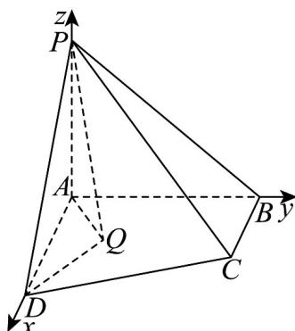
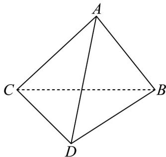

> [!faq]- 《专题03 空间向量的应用四大常考题型（高效培优专项训练）》官方解析
>
> > [!success]- **【答案】** A
>
> > [!note]- **【分析】**
> > 先根据两两垂直建立空间直角坐标系，然后得到各点的坐标，再应用二面角的空间向量解法得到参数的关系式，最后求出 $\left|AQ\right|$ 的表达式即可得解.
>
> > [!note]- **【解析】**
> > 以 AD, AB, AP 为 x, y, z 轴建立空间直角坐标系，如图所示，
> >
> > 
> >
> > 因为已知 $Q$ 是四边形ABCD内部一点，所以设 $Q(x_0,y_0,0)$
> >
> > 其中 $x_0 \in [0,4], y_0 \in [0,2]$ 且 $x_0 + y_0 \leq 4$ （即点 $Q$ 在平面 $ABCD$ 内部），则 $P(0,0,2), D(4,0,0), A(0,0,0)$ ，因为 $y$ 轴⊥平面 $PAD$ ，所以平面 $PAD$ 的法向量可取 $m = (0,1,0)$ ，又因为 $PD = (4,0,-2), QD = (4 - x_0, -y_0, 0)$ ，设平面 $QPD$ 的法向量为 $n = (x_1, y_1, z_1)$ ，则 $\left\{ \begin{array}{l} PD \cdot n = 0 \\ QD \cdot n = 0 \end{array} \right.$ ，即 $\left\{ \begin{array}{l} 4x_1 - 2z_1 = 0 \\ (4 - x_0)x_1 - y_0y_1 = 0 \end{array} \right.$ ，由题易得 $y_0 \neq 0$ ，令 $x_1 = 1$ ，则 $y_1 = \frac{4 - x_0}{y_0}, z_1 = 2$ ，所以 $\vec{n} = \left(1, \frac{4 - x_0}{y_0}, 2\right)$ ，因为二面角 $Q - PD - A$ 的平面角大小为 $\frac{\pi}{3}$ ，所以 $\left|\cos m, n\right| = \frac{\left|\vec{m} \cdot n\right|}{\left|\vec{m}\right| \left|\vec{n}\right|} = \frac{\frac{4 - x_0}{y_0}}{\sqrt{1^2 + \left(\frac{4 - x_0}{y_0}\right)^2 + 2^2}} = \frac{1}{2}$ ，即 $4\left(\frac{4 - x_0}{y_0}\right)^2 = 5 + \left(\frac{4 - x_0}{y_0}\right)^2$ ，解得 $y_0 = \sqrt{\frac{3}{5}} |4 - x_0| = \frac{\sqrt{15}}{5}(4 - x_0)$ ，所以 $\left|AQ\right| = \left|(x_0, y_0, 0)\right| = \sqrt{x_0^2 + y_0^2} = \sqrt{x_0^2 + \frac{3}{5}(4 - x_0)^2} = \sqrt{\frac{8}{5}(x_0^2 - 3x_0 + 6)}$ ，当 $x_0 = \frac{3}{2}$ 时， $\left|AQ\right|_{\min} = \sqrt{6}$ ，所以线段 $AQ$ 长度的最小值是 $\sqrt{6}$ 。
> >
> > 故选：A.
> >
> > 35. 四面体 $ABCD$ 中， $AB \perp BD$ ， $CD \perp BD$ ， $AB = 3$ ， $BD = 2$ ， $CD = 4$ ，平面 $ABD$ 与平面 $BCD$ 的夹角为 $\frac{\pi}{3}$ ，则 $AC$ 的值可能为（）A.5 B. $\sqrt{23}$ C. $\sqrt{35}$ D. $\sqrt{41}$
> >
> > 【答案】D
> >
> > 【分析】根据给定条件，利用空间向量数量积运算律求解判断作答·
> >
> > 【详解】在四面体 $ABCD$ 中， $AB \perp BD$ ， $CD \perp BD$ ，则 $\widehat{BA}, \widehat{DC}$ 是二面角 $A - BD - C$ 的平面角，如图，
> >
> > 
> >
> > $$
> > A C = A B + B D + D C = - B A + B D + D C
> > $$
> >
> > 而 $AB = 3$ ， $BD = 2$ ， $CD = 4$
> >
> > $$
> > A C ^ {2} = B A ^ {2} + B D ^ {2} + D C ^ {2} - 2 B A \cdot D C = 9 + 4 + 1 6 - 2 \times 3 \times 4 \cos \left\langle B A, D C \right\rangle = 2 9 - 2 4 \cos \left\langle B A, D C \right\rangle
> > $$
> >
> > 因为平面 $ABD$ 与平面 $BCD$ 的夹角为 $\frac{\pi}{3}$ ，则当 $\langle BA, DC \rangle = \frac{\pi}{3}$ 时， $|AC| = \sqrt{17}$ ，
> >
> > 当 $\langle BA, DC \rangle = \frac{2\pi}{3}$ 时， $|AC| = \sqrt{41}$
> >
> > 所以 AC 的值可能为 $\sqrt{17}$ 和 $\sqrt{41}$ .
> >
> > 故选 **D**.
