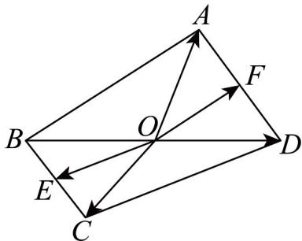

> [!faq]- 《专题03 空间向量的应用四大常考题型（高效培优专项训练）》官方解析
>
> > [!success]- **【答案】** A. $-\frac{1}{4}$ B. $-\frac{1}{3}$ C. $\frac{2 - \sqrt{2}}{4}$ D. $\frac{\sqrt{2} - 2}{4}$
>
> > [!note]- **【分析】**
> > 应用向量夹角求法及数量积的运算律求 $\cos \angle EOF$ ·
>
> > [!note]- **【解析】**
> > 翻折后如图所示，易知 $OA \perp BD$ ， $OC \perp BD$ ，
> >
> > 
> >
> > 结合已知有 $OA \perp OB$ ， $OC \perp OD$ ， $<OB, OD>=\pi$ ， $<OA,$ $OC>=\frac{\pi}{4}$ ，
> >
> > 易知 $OE = \frac{1}{2}(OB + OC)$ ， $OF = \frac{1}{2}(OA + OD)$ ，设正方形边长为 2，
> >
> > 所以 $OA = OB = OC = OD = \sqrt{2}$ ， $OE = OF = 1$
> >
> > $$
> > \cos <   \stackrel {\square \square \square} {O E}, \stackrel {\square \square \square} {O F} > = \frac {\stackrel {\square \square \square} {O E} \cdot \stackrel {\square \square \square} {O E}}{\left| O E \right| \cdot \left| O F \right|} = \frac {1}{4} \cdot \frac {\stackrel {\square \square \square} {O B} \cdot \stackrel {\square \square \square} {O A} + \stackrel {\square \square \square} {O B} \cdot \stackrel {\square \square \square} {O D} + \stackrel {\square \square \square} {O C} \cdot \stackrel {\square \square \square} {O A} + \stackrel {\square \square \square} {O C} \cdot \stackrel {\square \square \square} {O D}}{1 \times 1} = \frac {0 - 2 + \sqrt {2} + 0}{4} = \frac {\sqrt {2} - 2}{4}.
> > $$
> >
> > 所以 $\cos\angle EOF$ 的值为 $\frac{\sqrt{2}-2}{4}$ .
> >
> > 故选 **D**
