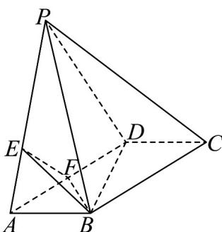
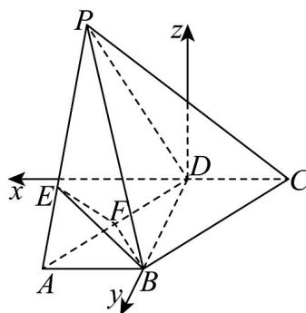
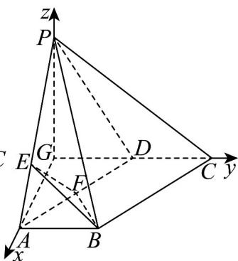
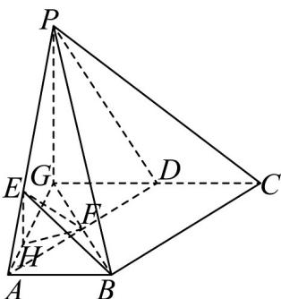

> [!faq]- 《专题03 空间向量的应用四大常考题型（高效培优专项训练）》官方解析
>
> > [!success]- **【答案】** (1)证明见解析 (2)1
>
> > [!note]- **【分析】**
> > （ $^{1}$ ）利用余弦定理求得 BD，根据勾股定理证得 $BD \perp DC$ ，再根据面面垂直的性质即可证明 $BD \perp$ 平面 PCD
> >
> > (2) 方法1：建立空间直角坐标系，利用空间向量的方法结合已知条件求得二面角 $E - BF - C$ 平面角的表达式，得到关于 $z$ 的方程，解出 $z$ 即可确定四棱锥 $P - ABCD$ 的高进而求得四棱锥体积；方法2：建立空间直角坐标系，利用空间向量的方法结合已知条件求得二面角 $E - BF - C$ 平面角的表达式，得到关于 $z$ 的方程，解出 $z$ 即可确定四棱锥 $P - ABCD$ 的高进而求得四棱锥体积；方法3：根据已知条件，利用空间中线线、线面的平行垂直关系，求得四棱锥的高，从而求得四棱锥体积。
>
> > [!note]- **【解析】**
> > （1）
> >
> > 
> > 图1
> >
> > 连结 $BD$ ，在 $\triangle BCD$ 中， $BC = 2$ ， $CD = 1$ ， $\angle BCD = 60^{\circ}$
> >
> > 由余弦定理 $BD^{2} = 1 + 4 - 2 \times 1 \times 2 \times \cos 60^{\circ} = 3$ ，即 $BD = \sqrt{3}$
> >
> > 此时 $BD^{2} + DC^{2} = BC^{2}$ ， $\therefore BD\perp DC$
> >
> > 又平面 $PCD \perp$ 平面 ABCD，平面 $PCD \cap$ 平面 ABCD = CD， $BD \subset$ 平面 ABCD ，∴ $BD \perp$ 平面 PCD .
> >
> > (2) 解法 $^{1}$ ：如图 $^{2}$ 建系，
> >
> > 以 D 为原点， $\overset{\circ}{CD}$ ， $\overset{\circ}{DB}$ 方向为 x, y 轴，垂直于 xDy 平面向上方向为 z 轴，
> > 设 $P(x,0,z)$ ，则 $D(0,0,0), A(1,\sqrt{3},0), B(0,\sqrt{3},0), F\left(\frac{1}{2},\frac{\sqrt{3}}{2},0\right)$ ∴ $AP = (x - 1, -\sqrt{3}, z), AB = (-1, 0, 0)$ ，由 $AB \perp AP$ 得 $AB \cdot AP = 0$ ，即 x = 1，
> > 由 $\overset{\circ}{PE} = 2EA$ ，得 $E\left(1, \frac{2\sqrt{3}}{3}, \frac{z}{3}\right)$ ，∴ $BF = \left(\frac{1}{2}, -\frac{\sqrt{3}}{2}, 0\right), BE = \left(1, -\frac{\sqrt{3}}{3}, \frac{z}{3}\right)$ 设 $n_{1}=(a,b,c)$ 是平面 BEF 的法向量，
> >
> > 取 $c = 2\sqrt{3}, b = -z, a = -\sqrt{3}z$ ，得 $n_1^{\square} = (\sqrt{3}z, z, -2\sqrt{3})$
> >
> > 平面 $ABF$ 的法向量为 $n_2 = (0,0,1)$ ，二面角 $E - BF - C$ 的大小为 $135^\circ$ ，
> >
> > 则 $\left|\cos135^{\circ}\right|=\frac{\left|\begin{matrix}\sqcup\\n_{1}\cdot\sqcup\\n_{2}\end{matrix}\right|}{\left|\begin{matrix}n_{1}\end{matrix}\right|\cdot\left|\begin{matrix}n_{2}\end{matrix}\right|}=\frac{2\sqrt{3}}{\sqrt{4z^{2}+12}}$ ，解得 $z=\sqrt{3}$ ，
> >
> > $$
> > S _ {A B C D} = 2 ^ {\prime} \frac {1}{2} B C \times C D \times \sin D B C D = 2 ^ {\prime} \frac {1}{2} ^ {\prime} 2 ^ {\prime} 1 ^ {\prime} \frac {\sqrt {3}}{2} = \sqrt {3},
> > $$
> >
> > $V_{P - ABCD} = \frac{1}{3}\times z\times S_{ABCD} = 1$
> >
> > 
> >
> > 
> > 图2
> > 图3
> >
> > 解法 $^{2}$ ：过点 P 作 $PG \perp CD$ ，交 CD 的延长线于 G，连接 AG，
> >
> > ∵ 平面 $PCG \perp$ 平面 ABCG ，平面 $PCG \cap$ 平面 ABCG = CG
> >
> > $PG \subset$ 平面 $ABCG$ ，∴ $PG \perp$ 平面 $ABCG$ ，
> >
> > $\because PA \perp AB, CD \parallel AB, \therefore PA \perp CD$
> >
> > $AG \subset$ 平面 $PAG$ ， $PG \subset$ 平面 $PAG$ ，又 $AG \cap PG = G$
> >
> > ∴ CD ⊥ 平面 PAG，AG ⊂ 平面 PAG，\ CG^ AG，
> >
> > 如图3所示，以 $GC, GP$ 方向为 $y, z$ 轴，垂直于 $PGC$ 平面方向为 $x$ 轴建系，
> >
> > $$
> > P (0, 0, z), D (0, y, 0), C (0, y + 1, 0), A (\sqrt {3}, y - 1, 0), B (\sqrt {3}, y, 0)
> > $$
> >
> > 则 $AB = (0,1,0)$ ， $AP = (-\sqrt{3},1 - y,z)$
> >
> > $\because AB\perp AP,\backslash AB\times AP=1-y=0,$ 得 $y=1,\therefore B(\sqrt{3},1,0),F\left(\frac{\sqrt{3}}{2},\frac{1}{2},0\right)$
> >
> > 由 $\stackrel{\square\square\square}{PE} = 2EA$ ，得 $E\left(\frac{2\sqrt{3}}{3},0,\frac{z}{3}\right),\therefore \overrightarrow{BF} = \left(-\frac{\sqrt{3}}{2}, - \frac{1}{2},0\right),\overrightarrow{BE} = \left(-\frac{\sqrt{3}}{3}, - 1,\frac{z}{3}\right)$
> >
> > 设 $n_{1}^{ \square }=(a,b,c)$ 是平面 BEF 的法向量，
> >
> > $$
> > \left\{ \begin{array}{l l} \vec {\square} & \square \vec {\square} \\ n _ {1} \cdot B E = 0 \\ n _ {1} \cdot B E = 0 \end{array} \Rightarrow \left\{ \begin{array}{l} \sqrt {3} a + b = 0 \\ - \frac {\sqrt {3}}{3} a - b + \frac {c z}{3} = 0 \end{array} \Rightarrow \left\{ \begin{array}{l} \sqrt {3} a + b = 0 \\ 2 \sqrt {3} a + c z = 0 \end{array} \right. \right. \right.,
> > $$
> >
> > 取 $c = 2\sqrt{3}, a = -z, b = \sqrt{3}z$ ，得 $n_1 = (-z, \sqrt{3}z, 2\sqrt{3})$
> >
> > 平面 $ABF$ 的法向量为 $\overline{n_2} = (0,0,1)$ ，二面角 $E - BF - C$ 的大小为 $135^{\circ}$ ，
> >
> > 则 $\left|\cos135^{\circ}\right|=\frac{\left|\begin{matrix}\sqcup\\n_{1}\end{matrix}\cdot\begin{matrix}\sqcup\\n_{2}\end{matrix}\right|}{\left|\begin{matrix}n_{1}\end{matrix}\right|\cdot\left|\begin{matrix}n_{2}\end{matrix}\right|}=\frac{2\sqrt{3}}{\sqrt{4z^{2}+12}}$ ，解得 $z=\sqrt{3}$ ，
> >
> > $$
> > S _ {A B C D} = 2 ^ {\prime} \frac {1}{2} B C \times C D \times \sin \text {D} B C D = 2 ^ {\prime} \frac {1}{2} ^ {\prime} 2 ^ {\prime} 1 ^ {\prime} \frac {\sqrt {3}}{2} = \sqrt {3},
> > $$
> >
> > $$
> > \therefore V _ {P - A B C D} = \frac {1}{3} \cdot P G \cdot S _ {A B C D} = 1
> > $$
> >
> > 解法 $^{3}$ ：过点 P 作 $PG \perp CD$ ，交 CD 的延长线于 G，连接 DG, AG
> >
> > 
> >
> > 图4 $\because PA\perp AB\quad CD\parallel AB\quad \therefore PA\perp CD$
> >
> > $AG \subset$ 平面 $PAG$ ， $PG \subset$ 平面 $PAG$ ，又 $AG \cap PG = G$
> >
> > ∴ CD ⊥ 平面 PAG，AG ⊂ 平面 PAG，\ CG^ AG，
> >
> > 由平面 $PCG \perp$ 平面 $ABCG$ ，平面 $PCG \cap$ 平面 $ABCG = CG$ ， $PG \subset$ 平面 $ABCG$
> >
> > $\therefore PG \perp$ 平面 $ABCG$
> >
> > 因为 $\overline{PE}=2\overline{EA}$ ，所以 E 为线段 AP 上靠近点 A 的三等分点，
> >
> > 设线段 AG 上靠近点 A 的三等分点为 H，连 EH，HF，
> >
> > 则 $EH \parallel PG$ ， $EH \perp$ 平面 $ABCG$ ， $BG \subset$ 平面 $ABCG$ ，所以 $EH \perp BG$
> >
> > 在 Rt△ADG 中， $AD = 2$ ， $\angle ADG = 60^{\circ}$ ， $\therefore AG = \sqrt{3}$ ，GD = 1
> >
> > ∴ 四边形 ABDG 是矩形，BG = AD = 2
> >
> > 在 $\triangle HGF$ 中， $\angle HGF = 30^{\circ}$ ， $GH = \frac{2\sqrt{3}}{3}$ ， $GF = 1$
> >
> > 因为 $\cos\Phi HGF=\frac{GH^{2}+GF^{2}-HF^{2}}{2GH\times GF}$ ，即 $\frac{\sqrt{3}}{2}=\frac{\frac{4}{3}+1-HF^{2}}{\frac{4\sqrt{3}}{3}}$ ，
> >
> > 解得： $FH=\frac{\sqrt{3}}{3}$ ，所以 $HF^{2}+GF^{2}=GH^{2}$ ，所以 $HF\perp BG$ ，
> >
> > $EH \subset$ 平面 $EHF$ ， $HF \subset$ 平面 $EHF$ ， $EH \cap HF = H$
> >
> > $\therefore BG \perp$ 平面 $EHF$ ， $EF \subset$ 平面 $EHF$ ， $\therefore EF \perp BG$
> >
> > $\therefore \angle EFH$ 是二面角 $E - BF - C$ 的平面角的补角，即 $\angle EFH = 45^{\circ}$
> >
> > $\therefore \triangle EHF$ 为等腰直角三角形， $\therefore EH = FH = \frac{\sqrt{3}}{3}$ ，从而 $PG = 3EH = \sqrt{3}$ ，
> >
> > $$
> > S _ {A B C D} = 2 ^ {\prime} \frac {1}{2} B C \times C D \times \sin \Phi B C D = 2 ^ {\prime} \frac {1}{2} ^ {\prime} 2 ^ {\prime} 1 ^ {\prime} \frac {\sqrt {3}}{2} = \sqrt {3}
> > $$
> >
> > $$
> > V _ {P - A B C D} = \frac {1}{3} \cdot P G \cdot S _ {A B C D} = 1
> > $$
