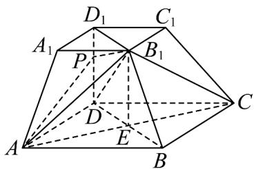
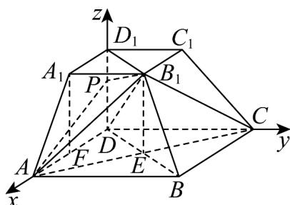

> [!faq]- 《专题03 空间向量的应用四大常考题型（高效培优专项训练）》官方解析
>
> > [!success]- **【答案】** (1)证明见解析 (2) $\frac{2}{3}$
>
> > [!note]- **【分析】**
> > （1）利用平行四边形性质得到 $DD_{1}//B_{1}E$ ，再结合全等三角形的性质和给定条件得到 $DD_{1}\perp AC$
> >
> > $DD_{1} \perp AD$ ，最后由线面垂直的判定定理证明即可·
> >
> > (2) 建立空间直角坐标系，设 $P(0,0,t)$ ， $0 \leq t \leq 1$ ，求出关键点的坐标和关键平面的法向量，再由二面角的向量求法求解即可·
>
> > [!note]- **【解析】**
> > （1）连接BD，交AC于点E，连接 $B_{1}E$ ， $B_{1}D_{1}$
> >
> > 
> >
> > 由题意得 $B_{1}D_{1} / / BD$ ，且 $B_{1}D_{1} = \sqrt{2}$ ， $BD = 2\sqrt{2}$ ， $E$ 为 $BD$ 中点，
> >
> > 所以 $B_{1}D_{1} / / DE$ 且 $B_{1}D_{1} = DE$
> >
> > 所以四边形 $B_{1}D_{1}DE$ 为平行四边形，所以 $DD_{1}//B_{1}E$ .①
> >
> > 在 $\triangle B_{1}BA$ 和 $\triangle B_{1}BC$ 中， $BA = BC$ ， $\angle B_{1}BA = \angle B_{1}BC$ ， $B_{1}B$ 是公共边，
> >
> > 故 $VB_{1}BA \cong VB_{1}BC$ ，故有 $B_{1}A = B_{1}C$ ，
> >
> > 又 $E$ 是 $AC$ 中点，所以 $B_{1}E \perp AC$ .
> >
> > 结合①可得 $DD_{1} \perp AC$ ．又 $DD_{1} \perp AD$
> >
> > 且 $AC \cap AD = A$ ，AC, $AD \subset$ 面 ABCD，故 $DD_{1} \perp$ 平面 ABCD.
> >
> > (2) 在梯形 $A_{1}ADD_{1}$ 中，取 AD 中点 F ，连接 $A_{1}F$ ，则 AF = 1 ，
> >
> > 易证四边形 $A_{1}FDD_{1}$ 是矩形，故 $DD_{1} = A_{1}F$ ， $A_{1}F \perp AD$ .
> >
> > 在 $Rt\triangle A_{1}FA$ 中，由勾股定理得 $A_{1}F = 1$ ，故 $DD_{1} = 1$ 。
> >
> > 以 $D$ 为坐标原点， $DA$ 的方向为 $x$ 轴正方向，建立如图所示的空间直角坐标系 $D - xyz$
> >
> > 
> >
> > 则 $A(2,0,0)$ ， $B(2,2,0)$ ， $B_{1}(1,1,1)$ ，设 $P(0,0,t)$ ， $0\leq t\leq 1$
> >
> > 则 $AB_{1}=(-1,1,1),\overline{AP}=(-2,0,t),\overline{DB}=(2,2,0)$
> >
> > 由（1）知 $DD_{1}\perp$ 平面ABCD，故 $DD_{1}\perp DB$ ，
> >
> > 又 $DD_{1} / / B_{1}E$ ，故 $DB\bot B_1E$ ，又 $DB\bot AC$ ，且 $AC\cap B_1E = E$
> >
> > $AC, B_{1}E \subset$ 面 $AB_{1}C$ ，故 $DB \perp$ 平面 $AB_{1}C$
> >
> > 故可取 $\vec{m} = \frac{1}{2}\overrightarrow{DB} = (1,1,0)$ 为平面 $AB_{1}C$ 的一个法向量.
> >
> > 设 $n = (x, y, z)$ 为平面 $PAB_{1}$ 的法向量，
> >
> > 则 $\left\{ \begin{array}{l} n \cdot AB = 0 \\ \rightarrow \square \square \\ n \cdot AP = 0 \end{array} \right.$ ，即 $\left\{ \begin{array}{l} -x + y + z = 0 \\ -2x + tz = 0 \end{array} \right.$ ，可取 $n = (t, t - 2, 2)$ .
> >
> > 设二面角 $P - AB_{1} - C$ 的大小为 $\theta$ ，则 $\sin \theta = \frac{3\sqrt{21}}{14}$ ，故 $\left|\cos \theta \right| = \sqrt{1 - \sin^2\theta} = \frac{\sqrt{7}}{14}$
> >
> > 所以 $\left|\cos\theta\right|=\left|\cos m,n\right|=\frac{\left|\frac{m}{2}\cdot n\right|}{\left|m\right|\cdot\left|n\right|}=\frac{\left|2t-2\right|}{\sqrt{2}\times\sqrt{t^{2}+(t-2)^{2}+4}}=\frac{\sqrt{7}}{14}$
> >
> > 整理得 $9t^{2} - 18t + 8 = 0$ ，解得 $t = \frac{2}{3}$ 或 $t = \frac{4}{3}$ （舍），故 $DP = \frac{2}{3}$ .
