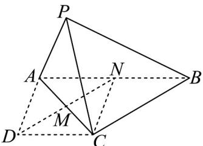
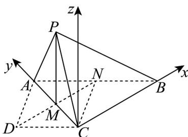

> [!faq]- 《专题03 空间向量的应用四大常考题型（高效培优专项训练）》官方解析
>
> > [!success]- **【答案】** (1)证明见解析 (2) $\frac{\sqrt{5}}{5}$
>
> > [!note]- **【分析】**
> > （1）利用菱形的对角线垂直，再结合平行关系和已知的面面垂直，即可证明线面垂直；
> >
> > (2) 利用空间向量法，假设三个坐标参数，再利用三个相等关系求解参数，然后求两个平面的法向量，利用空间向量的夹角公式计算即得·
>
> > [!note]- **【解析】**
> > （1）
> >
> > 
> >
> > 取 $AB$ 中点为 $N$ ，连接 $CN, DN$ 交 $AC$ 于点 $M$ ，由于 $AB // DC$ ， $AD = DC = 2$ ， $AB = 4$ ，所以四边形 $ADCN$ 是菱形，则 $DN \perp AC$ ，又因为四边形 $DCBN$ 是平行四边形，则 $BC // DN$ ，故 $BC \perp AC$ 又因为平面 $PAC \perp$ 平面 $ABC$ ，平面 $PAC \cap$ 平面 $ABC = AC$ ， $BC \subset$ 平面 $ABC$ ，所以 $BC \perp$ 平面 $PAC$ ；
> >
> > (2)
> >
> > 
> >
> > 由 $PA = PC, AM = CM$ 可得： $PM \perp AC$
> >
> > 又因为平面 $PAC \perp$ 平面 $ABC$ ，平面 $PAC \cap$ 平面 $ABC = AC$ ， $PM \subset$ 平面 $PAC$
> >
> > 所以 $PM \perp$ 平面 $ABC$ ，再由 $BC \perp$ 平面 $PAC$ ， $AC \subset$ 平面 $PAC$ ，故 $BC \perp AC$
> >
> > 如图建系，可设 $A(0,a,0),M\left(0,\frac{a}{2},0\right),B(b,0,0),P\left(0,\frac{a}{2},c\right)$
> >
> > 由 $PC = DC = 2$ ，可得 $\left|\overrightarrow{CP}\right| = \left|\left(0,\frac{a}{2},c\right)\right| = \sqrt{\frac{a^2}{4} + c^2} = 2$ ①，
> >
> > 由 AB = 4 ，因 $\overline{AB} = (b, -a, 0)$ ，则 $\left|AB\right| = \sqrt{b^{2} + a^{2}} = 4$ ②，
> >
> > <!-- source-part:2 pages:51-53 -->
> >
> > 再由异面直线 $PC$ 与 $AB$ 所成角的余弦值为 $\frac{1}{4}$ 及 $CP = \left(0, \frac{a}{2}, c\right)$ ，
> >
> > 可得： $\frac{\left|\overrightarrow{CP}\cdot\overrightarrow{AB}\right|}{\left|\overrightarrow{CP}\right|\cdot\left|AB\right|}=\frac{\frac{a^{2}}{2}}{4\times2}=\frac{a^{2}}{16}=\frac{1}{4}$ ，解得 a=2
> >
> > 将其代入①，②式可得： $b=2\sqrt{3},c=\sqrt{3}$
> >
> > 则 $AB = (2\sqrt{3}, -2, 0), AP = (0, -1, \sqrt{3})$
> >
> > 设平面 ABP 的法向量为 $n = (x, y, z)$ ,
> >
> > 则 $\left\{ \begin{array}{l} AB \cdot n = 2\sqrt{3} x - 2y = 0 \\ AP \cdot n = -y + \sqrt{3} z = 0 \end{array} \right.$ ，故可取 $n = (1, \sqrt{3}, 1)$ ，
> >
> > 由图可得平面 $PAC$ 的法向量为 $m = (1,0,0)$
> >
> > $$
> > \cos \left\langle \stackrel {\rightarrow} {m}, n \right\rangle = \frac {1}{1 \times \sqrt {5}} = \frac {\sqrt {5}}{5} > 0
> > $$
> >
> > 则平面 $BPA$ 与平面 $PAC$ 所成角的余弦值是 $\frac{\sqrt{5}}{5}$
