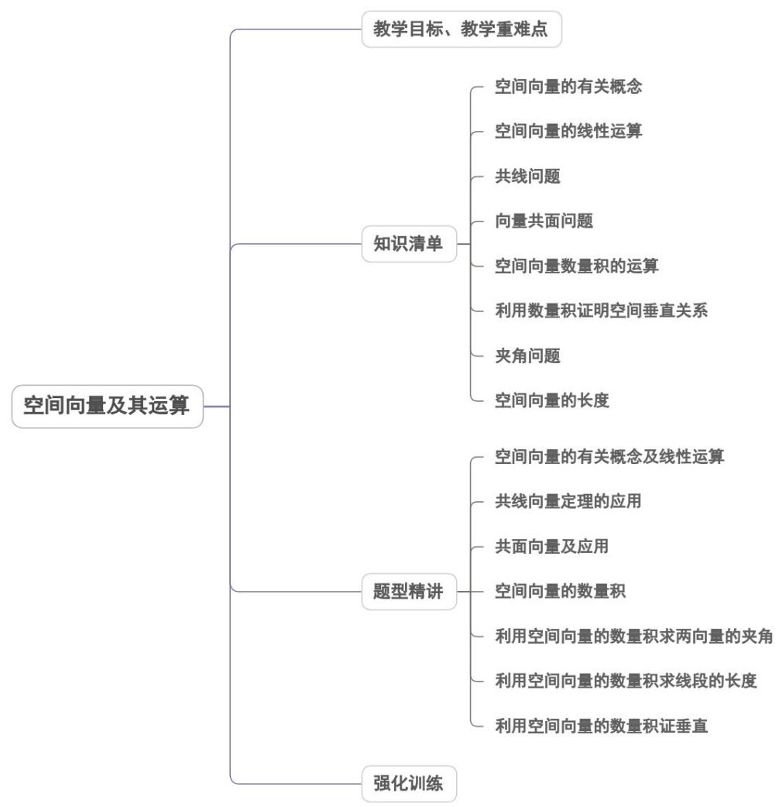
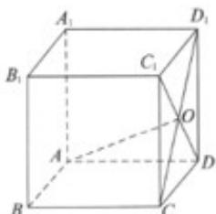
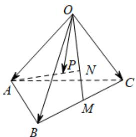

<!-- source-part:1 pages:1-50 -->

## 专题1.1 空间向量及其运算

## 内容概览

## 教学目标、教学重难点

<table><tr><td>教学目标</td><td>1.理解空间向量的相关概念的基础上进行与向量的加、减运算、数量积的运算、夹角的相关运算及空间距离的求解.2.利用空间向量的相关定理及推论进行空间向量共线、共面的判断.3.理解空间向量的相关概念的基础上进行与向量的加、减运算、数量积的运算、夹角的相关运算及空间距离的求解.</td></tr><tr><td>教学重难点</td><td>1.重点空间向量的线性运算,空间向量的数量积,空间向量的夹角的相关运算.2.难点空间向量的共线定理、共面定理及推论.</td></tr></table>

## 知识清单

## 知识点 01 空间向量的有关概念

## 1. 空间向量

(1)定义：在空间，具有大小和方向的量叫做空间向量。(2)长度或模：空间向量的大小。(3)表示方法：

①几何表示法：空间向量用有向线段表示；

② 字母表示法：用字母 $a, b, c, \ldots$ 表示；若向量 $a$ 的起点是 $A$ ，终点是 $B$ ，也可记作：AB，其模记为 $|a|$ 或 |AB|.

## 【即学即练】

1.【多选】给出下列命题，其中正确的命题是（）

【答案】

A. 若 $\left|a\right| = \left|b\right|$ ，则 $a = b$ 或 $a = -b^1$ B. 若向量 $a$ 是向量 $b$ 的相反向量，则 $\left|a\right| = \left|b\right|$

C．在正方体 $ABCD-A_{1}B_{1}C_{1}D_{1}$ 中， $AC=A_{1}C_{1}$ D．若空间向量 m，n，p 满足 m=n，n=p，则 m=p

【解析】依据向量相等的概念，选项 $^{A}$ 判断错误；

若向量 $a$ 是向量 $b$ 的相反向量，则 $\left|a\right| = \left|b\right|$ ·选项B判断正确；

依据向量相等的概念，在正方体 $ABCD - A_{1}B_{1}C_{1}D_{1}$ 中， $AC = A_{1}C_{1}$ 选项 C 判断正确；

依据向量相等的概念，若空间向量 $m$ ， $n$ ， $p$ 满足 $m = n$ ， $n = p$ ，则 $m = p$ ·选项D判断正确·

故选：BCD.

2.如图，在四棱柱的上底面ABCD中， $\mathrm{AB} = \mathrm{DC}$ ，则下列向量相等的是( )

【答案】

A.AD与CB B.OA与OC C.AC与DB D.DO与OB

【解析】对于 A，AD 与 CB 的方向相反，因而不是相等向量，所以 A 错误；

对于 B，OA 与 OC 的方向相反，因而不是相等向量，所以 B 错误；

对于 C，AC 与 DB 的方向不同，因而不是相等向量，所以 C 错误；

对于 D，DO 与 OB 的方向相同，大小相等，是相等向量，因而 D 正确．故选 D

知识点 02 空间向量的线性运算

(1)向量的加法、减法

<table><tr><td rowspan="2">空间向量的运算</td><td>加法</td><td>OB = OA + OC = a + b</td><td rowspan="2"></td></tr><tr><td>减法</td><td>CA = OA - OC = a - b</td></tr><tr><td rowspan="2">加法运算律</td><td colspan="3">1交换律: a + b = b + a</td></tr><tr><td colspan="3">2结合律:(a + b) + c = a + (b + c)</td></tr></table>

(2)空间向量的数乘运算

①定义：实数 $\lambda$ 与空间向量 a 的乘积 $\lambda a$ 仍然是一个向量，称为向量的数乘运算。

当 $\lambda > 0$ 时， $\lambda a$ 与向量 $a$ 方向相同；当 $\lambda < 0$ 时， $\lambda a$ 与向量 $a$ 方向相反；当 $\lambda = 0$ 时， $\lambda a = 0$ ； $\lambda a$ 的长度是 $a$ 的长度的 $|\lambda|$ 倍。

②运算律: 结合律 : $\lambda(\mu a) = \mu(\lambda a) = (\lambda \mu)a$ . 分配律 : $(\lambda + \mu)a = \lambda a + \mu a$ , $\lambda(a + b) = \lambda a + \lambda b$ .

【即学即练】

已知正方体 $ABCDA_{1}B_{1}C_{1}D_{1}$ ，则下列各式运算结果不是AC1的为( )

A. AB + AD + AA1

B. AA1 + A1B1 + A1D1

C. AB + BC + CC1

D. AB + AC + CC1

【解析】选项 A 中， $AB + AD + AA1 = AC + AA1 = AC1$ ；选项 B 中， $AA1 + A1B1 + A1D1 = AA1 + (A1B1 + A1D1) = AA1 + A1C1 = AC1$ ；选项 C 中， $AB + BC + CC1 = AC + CC1 = AC1$ ；选项 D 中， $AB + AC + CC1 = AB + (AC + CC1) = AB + AC1 \neq AC1$ 。故选 D。

## 知识点 03 共线问题

共线向量

(1)定义：表示若干空间向量的有向线段所在的直线互相平行或重合，则这些向量叫做共线向量或平行向量。

(2)方向向量：在直线 $l$ 上取非零向量 $a$ ，与向量 $a$ 平行的非零向量称为直线 $l$ 的方向向量.

规定：零向量与任意向量平行，即对任意向量 $a$ ，都有 $0\| a$

(3)共线向量定理：对于空间任意两个向量 $a, b (b \neq 0), a \| b$ 的充要条件是存在实数 $\lambda$ 使 $a = \lambda b$ .

(4) $O$ 是直线 $l$ 上一点，在直线 $l$ 上取非零向量 $a$ ，则对于直线 $l$ 上任意一点 $P$ ，由数乘向量定义及向量共线的充要条件可知，存在实数 $\lambda$ ，使得 $\mathrm{OP} = \lambda a$ .

## 【即学即练】

1. 已知空间四边形 $ABCD$ ，点 $E, F$ 分别是 $AB$ 与 $AD$ 边上的点， $M, N$ 分别是 $BC$ 与 $CD$ 边上的点，若 $AE = \lambda AB$ ， $\stackrel{\mathrm{uuu}}{AF} = \lambda AD, CM = \mu CB, CN = \mu CD$ ，则向量 $\stackrel{\mathrm{uuu}}{EF}$ 与 $\stackrel{\mathrm{uuuu}}{MN}$ 满足的关系为（）A. $\stackrel{\mathrm{uuu}}{EF} = MN$ B. $\stackrel{\mathrm{uuu}}{EF} // MN$ C. $\left|\stackrel{\mathrm{uuu}}{EF}\right| = \left|\stackrel{\mathrm{uuuu}}{MN}\right|$ D. $\left|\stackrel{\mathrm{uuu}}{EF}\right| \neq \left|\stackrel{\mathrm{uuuu}}{MN}\right|$

【解析】由 $AE = \lambda AB$ ， $AF = \lambda AD$ ，得 $EF = AF - AE = \lambda (AD - AB) = \lambda DB$ ，所以 $EF, DB$ 共线，同理，由 $CM = \mu CB$ ， $CN = \mu CD$ ，得 $MN = \mu DB$ ，所以 $MN, DB$ 共线，所以 $EF, MN$ 共线，即 $EF // MN$ .

故选：B.

2. 在下列命题中：

①若向量 $a, b$ 共线，则 $a, b$ 所在的直线平行；

②若向量 $a, b$ 所在的直线是异面直线，则 $a, b$ 一定不共面；

③若三个向量 $a, b, c$ 两两共面，则 $a, b, c$ 三个向量一定也共面；
④已知三个向量 $a, b, c$ ，则空间任意一个向量 $p$ 总可以唯一表示为 $p = xa + yb + zc$ ：
⑤若 $a$ 与 $b$ 是平面 $\alpha$ 上互不平行的向量，点 $A \ddot{I} \alpha$ ，点 $B \notin \alpha$ ，则 $\overline{AB}$ 与 $a$ 、 $b$ 一定不共面。

其中正确命题的个数为（ ）A.0 B.1 C.2 D.3

【解析】此题考查向量的知识点；对于①：根据两向量共线定义知道，两向量共线有可能两向量所在的直线重合，所以此命题错误；对于②：两个向量可以平移到一个平面内，所以此命题错误；对于③：若三个向量 $a, b, c$ 两两共面，这三个向量有可能不共面，所以此命题错误；对于④：根据空间向量的基本定理知道，这三个向量要不共面才可以，所以此命题错误，对于⑤, 若 $a$ 与 $b$ 是平面 $\alpha$ 上互不平行的向量，即 $a$ 与 $b$ 可以作为平面 $\alpha$ 上的一组基底，点 $A \ddot{1} \alpha$ ，点 $B \notin \alpha$ ，但是直线 $AB$ 可以平行平面 $\alpha$ ，则 $\overline{AB}$ 与 $a$ 、 $b$ 共面，故⑤错误所以选 A

## 知识点 04 向量共面问题

共面向量

(1)定义：平行于同一个平面的向量叫做共面向量.

(2)共面向量定理：若两个向量 $a, b$ 不共线，则向量 $p$ 与向量 $a, b$ 共面的充要条件是存在唯一的有序实数对 $(x, y)$ ，使 $p = xa + yb$ .

(3)空间一点 P 位于平面 ABC 内的充要条件：存在有序实数对 $(x, y)$ ，使 AP = xAB + yAC 或对空间任意一点 O，有 OP = OA + xAB + yAC.

【即学即练】

1. 下列条件中，一定使空间四点 P、A、B、C 共面的是（）

【答案】
A. $OA + OB + OC = -OP$ B. $OA + OB + OC = OP$ C. $OA + OB + OC = 2OP$ D. $OA + OB + OC = 3OP$

【答案】D

【详解】对于A选项， $OP = -OA - OB - OC$ ， $(-1) + (-1) + (-1) = -3 \neq 1$ ，所以点P与A、B、C三点不共面；
对于B选项， $OP = OA + OB + OC$ ， $1 + 1 + 1 = 3 \neq 1$ ，所以点P与A、B、C三点不共面；

对于 C 选项， $\overline{OP}=\frac{1}{2}\overline{OA}+\frac{1}{2}\overline{OB}+\frac{1}{2}\overline{OC}$ ， $\frac{1}{2}+\frac{1}{2}+\frac{1}{2}=\frac{3}{2}\neq1$ ，所以点 P 与 A、B、C 三点不共面；

对于 D 选项， $OP = \frac{1}{3}OA + \frac{1}{3}OB + \frac{1}{3}OC$ ， $\frac{1}{3} + \frac{1}{3} + \frac{1}{3} = 1$ ，所以点 P 与 A、B、C 三点共面。故选：D.

2. 若 $\{a, b, c\}$ 构成空间的一个基底，则下列向量共面的是（）

【答案】
A. $b + c$ , $b$ , b - c
B. $a$ , $a + b$ , a - b
C. $a + b$ , $a - b$ , c
D. $a$ , $a - b$ , c

【答案】AB

$$
(b + c) + (b - c) = 2 b
$$

$$
a + b + a - b = 2 a
$$

c 共面，则存在实数 x, y 使得 $c = x(a + b) + y(a - b) = (x + y)a + (x - y)b$ ，则 a, b, c 共面，与已知矛盾，因此 C

选项中向量不共面；同理 D 选项中向量也不共面．故选：AB．

## 知识点 05 空间向量数量积的运算

空间向量的数量积

(1)定义：已知两个非零向量 $a, b$ ，则 $|a||b|\cos \langle a, b \rangle$ 叫做 $a, b$ 的数量积，记作 $a \cdot b$ . 即 $a \cdot b = |a||b|\cos \langle a,$

b> .

规定：零向量与任何向量的数量积为0.

(2)常用结论 $(a, b$ 为非零向量）

① $a \perp b \Leftrightarrow a \cdot b = 0$ . ② $a \cdot a = |a||a|\cos \langle a, a \rangle = |a|^2$ . ③ $\cos \langle a, b \rangle = .$

(3)数量积的运算律

<table><tr><td>数乘向量与数量积的结合律</td><td> $(\lambda a) \cdot b = \lambda (a \cdot b) = a \cdot (\lambda b)$ </td></tr><tr><td>交换律</td><td> $a \cdot b = b \cdot a$ </td></tr><tr><td>分配律</td><td> $a \cdot (b + c) = a \cdot b + a \cdot c$ </td></tr></table>

【即学即练】

如图，在三棱锥 $P - ABC$ 中， $PA \perp$ 平面 $ABC$ ， $CB \perp AB$ ， $AB = BC = a$ ， $PA = b$ 。

(1)确定 $PC$ 在平面 $ABC$ 上的投影向量，并求 $PC \cdot AB$ ；

(2)确定 $PC$ 在 $AB$ 上的投影向量，并求 $PC \cdot AB$

【答案】(1) $PC$ 在平面 $ABC$ 上的投影向量为 $AC$ ， $PC \cdot AB = a^2$ ；(2) $PC$ 在 $AB$ 上的投影向量为 $AB$

$PC\cdot AB = a^2$

(1)因为 $PA \perp$ 平面 ABC，所以 PC 在平面 ABC 上的投影向量为 AC，

因为 $PA \perp$ 平面 $ABC$ ， $AB \mid$ 面 $ABC$ ，可得 $PA \perp AB$ ，所以 $PA \cdot AB = 0$ ，因为 $CB \perp AB$ ，所以 $BC \cdot AB = 0$

所以 $\overline{PC} \cdot \overline{AB} = \left( \overline{PA} + \overline{AB} + \overline{BC} \right) \cdot \overline{AB} = \overline{PA} \cdot \overline{AB} + \overline{AB} \cdot \overline{AB} + \overline{BC} \cdot \overline{AB} = 0 + a^{2} + 0 = a^{2}$

(2)由（1）知： $PC \cdot AB = a^{2}$ ， $\left|AB\right| = a$ ，所以PC在AB上的投影向量为：

$$
\left| \overrightarrow {P C} \right| \cdot \cos \left\langle \overrightarrow {P C}, \overrightarrow {A B} \right\rangle \cdot \frac {\overrightarrow {A B}}{\left| A B \right|} = \left| \overrightarrow {P C} \right| \cdot \frac {\overrightarrow {P C} \cdot \overrightarrow {A B}}{\left| P C \right| \cdot \left| A B \right|} \cdot \frac {\overrightarrow {A B}}{\left| A B \right|} = \frac {\overrightarrow {P C} \cdot \overrightarrow {A B}}{\left| A B \right|} \cdot \frac {\overrightarrow {A B}}{\left| A B \right|} = \frac {a ^ {2}}{a} \cdot \frac {\overrightarrow {A B}}{a} = \overrightarrow {A B}
$$

由数量积的几何意义可得： $PC\cdot AB = \left|AB\right|\cdot \left|AB\right| = a^2$

## 知识点 06 利用数量积证明空间垂直关系

当 $a \perp b$ 时， $a \cdot b = 0$ .

【即学即练】

如图，正方体 $ABCD - A_{1}B_{1}C_{1}D_{1}$ 的棱长是 $a$ ， $CD_{1}$ 和 $DC_{1}$ 相交于点 $O$ ：

(1)求 $\overset{\text{UUUU}}{CD_{1}}\cdot\overset{\text{UUUU}}{CD}$ ; (2)求 $\overset{\text{UUUU}}{AO}$ 与 $\overset{\text{UUUU}}{CB}$ 的夹角的大小余弦值；(3)判断 $\overset{\text{UUUU}}{AO}$ 与 $\overset{\text{UUUU}}{CD_{1}}$ 是否垂直.

【解析】(1)正方体 $ABCD-A_{1}B_{1}C_{1}D_{1}$ 中， $CD_{1}=\sqrt{2}a,CD_{1},CD=\frac{\pi}{4}$ ，故 $CD_{1}\cdot CD=\sqrt{2}a\times a\times\cos\frac{\pi}{4}=a^{2}$ ;

(2)由题意知， $AB \cdot AD = 0, AB \cdot AA_{1} = 0, AA_{1} \cdot AD = 0, AO = AD + DO = AD + \frac{1}{2}(AB + AA_{1})$

$|AO|=\sqrt{[AD+\frac{1}{2}(AB+AA_{1})]^{2}}=\frac{\sqrt{6}a}{2}$ ，故 $AO\cdot CB=-AO\cdot AD=-[AD+\frac{1}{2}(AB+AA_{1})]\cdot AD=-a^{2}$

$\cos AO, CB = \frac{AO \cdot CB}{|AO| \cdot |CB|} = \frac{-a^2}{\frac{\sqrt{6}}{2} a \cdot a} = -\frac{\sqrt{6}}{3}$ 故，故 $AO$ 与 $CB$ 的夹角的大小余弦值为 $\frac{\sqrt{6}}{3}$ ；

(3)由题意， $AB\cdot AD = 0,AB\cdot AA_{1} = 0,AA_{1}\cdot AD = 0$ ， $AO\cdot CD_{1} = [AD + \frac{1}{2}(AB + AA_{1})]\cdot (AA_{1} - AB) = \frac{1}{2} AA_{1}^{2} - \frac{1}{2} AB^{2} = 0$

故 $AO$ 与 $CD_{1}$ 垂直.

知识点 07 夹角问题

1. 定义：已知两个非零向量 $a$ 、 $b$ ，在空间任取一点 $\mathbf{D}$ ，作 $\overline{OA} = a, \overline{OB} = b$ ，则 $\angle AOB$ 叫做向量 $a$ 与 $b$ 的夹

角，记作 $\langle a,b\rangle$ ，如下图。

根据空间两个向量数量积的定义： $a\cdot b = |a|\cdot |b|\cdot \cos \langle a,b\rangle$ ，那么空间两个向量 $a$ 、 $b$ 的夹角的余弦 $\cos \langle a,b\rangle = \frac{a\cdot b\rightarrow}{|a|\cdot|b|}$ 。

2. 利用空间向量求异面直线所成的角

异面直线所成的角可以通过选取直线的方向向量，计算两个方向向量的夹角得到。

在求异面直线所成的角时，应注意异面直线所成的角与向量夹角的区别：如果两向量夹角为锐角或直角，则

异面直线所成的角等于两向量的夹角；如果两向的夹角为钝角，则异面直线所成的角为两向量的夹角的补角。

【即学即练】

如图，在平行六面体 $ABCD - A_{1}B_{1}C_{1}D_{1}$ 中，底面 $ABCD$ 是边长为2的正方形，侧棱 $AA_{1}$ 的长度为4，且

$\angle A_{1}AB = \angle A_{1}AD = 120^{\circ}$ .用向量法求:

(1) $BD_{1}$ 的长;

(2)直线 $BD_{1}$ 与 AC 所成角的余弦值.

【答案】(1) $2\sqrt{6}(2)\frac{\sqrt{3}}{3}$

$$
B D _ {1} = B B _ {1} + B _ {1} A _ {1} + A _ {1} D _ {1}
$$

$$
\stackrel {{\sqcup \sqcup \sqcup}} {{B D _ {1}}} ^ {2} = \left(\stackrel {{\sqcup \sqcup \sqcup}} {{B B _ {1}}} + \stackrel {{\sqcup \sqcup \sqcup}} {{B _ {1} A _ {1}}} + \stackrel {{\sqcup \sqcup \sqcup}} {{A _ {1} D _ {1}}}\right) ^ {2} = \stackrel {{\sqcup \sqcup \sqcup}} {{B B _ {1}}} ^ {2} + \stackrel {{\sqcup \sqcup \sqcup}} {{B _ {1} A _ {1}}} ^ {2} + \stackrel {{\sqcup \sqcup \sqcup}} {{A _ {1} D _ {1}}} ^ {2} + 2 \stackrel {{\sqcup \sqcup \sqcup}} {{B B _ {1}}} \cdot \stackrel {{\sqcup \sqcup \sqcup}} {{B _ {1} A _ {1}}} + 2 \stackrel {{\sqcup \sqcup \sqcup}} {{B B _ {1}}} \cdot \stackrel {{\sqcup \sqcup \sqcup}} {{A _ {1} D _ {1}}} + 2 \stackrel {{\sqcup \sqcup \sqcup}} {{B _ {1} A _ {1}}} \cdot \stackrel {{\sqcup \sqcup \sqcup}} {{A _ {1} D _ {1}}}
$$

$= 16 + 4 + 4 + 2 \times 4 \times 2 \cos 60^{\circ} + 2 \times 4 \times 2 \cos 120^{\circ} + 0 = 24$ ，故 $\left|BD_{1}\right| = 2\sqrt{6}$ ，所以 $BD_{1}$ 的长为 $2\sqrt{6}$ ；

$$
A C \cdot B D _ {1} = \left(A B + B C\right) \cdot \left(B B _ {1} + B _ {1} A _ {1} + A _ {1} D _ {1}\right) = A B \cdot B B _ {1} + A B \cdot B _ {1} A _ {1} + A B \cdot A _ {1} D _ {1} + B C \cdot B B _ {1} + B C \cdot B _ {1} A _ {1} + B C \cdot A _ {1} D _ {1}
$$

$$
= 2 \times 4 \cos 1 2 0 ^ {\circ} - 4 + 0 + 2 \times 4 \cos 1 2 0 ^ {\circ} + 0 + 4 = - 8
$$

$\left|\overline{A C}\right| = \sqrt{\left( \overline{A B} + \overline{B C} \right)^2} = \sqrt{ \overline{A B}^2 + 2 A B \cdot BC + \overline{B C}^2} = 2\sqrt{2}$ ，由（1）知： $\left|\overline{B D_1}\right| = 2\sqrt{6}$

设直线 $BD_{1}$ 与 $AC$ 所成角为 $\theta$ : $\cos \theta = \left|\cos \left\langle AC, BD_{1} \right\rangle\right| = \left|\frac{AC \cdot BD_{1}}{|AC| \cdot |BD_{1}|}\right| = \left|\frac{-8}{2\sqrt{2} \times 2\sqrt{6}}\right| = \frac{\sqrt{3}}{3}$ ,

∴直线 $BD_{1}$ 与 AC 所成角的余弦值为 $\frac{\sqrt{3}}{3}$

## 知识点 08 空间向量的长度

1. 定义：在空间两个向量的数量积中，特别地 $a \cdot a = |a| \cdot |a| \cos 0^\circ = |a|^2$ ，所以向量 $a$ 的模： $|a| = \sqrt{a^2}$

$$
| \stackrel {\rightarrow} {a \pm b} = \sqrt {(a \pm b) ^ {2}} = \sqrt {a ^ {2} \pm 2 a \cdot b + b ^ {2}}
$$

$$
\mid a + b + c \mid = \sqrt {(a + b + c) ^ {2}} = \sqrt {a ^ {2} + b ^ {2} + c ^ {2} + 2 a \cdot b + 2 b \cdot c + 2 c \cdot a}
$$

2. 利用向量求线段的长度。

将所求线段用向量表示，转化为求向量的模的问题。一般可以先选好基底，用基向量表示所求向量，然后利

用 $\left|a\right|^{2}=a^{2}$ 来求解。

## 【即学即练】

1.如图，棱长为1的正四面体（四个面都是正三角形） $OABC$ ， $M$ 是棱 $BC$ 的中点，点 $N$ 在线段 $OM$ 上，点 $P$ 在线段 $AN$ 上，且 $MN = \frac{1}{2} ON$ ， $AP = \frac{3}{4} AN$

(1)用向量 $OA$ ， $OB$ ， $OC$ 表示 $AN$ ；(2)求 $\left|OP\right|$ .

【答案】(1) $AN = -OA + \frac{1}{3}OB + \frac{1}{3}OC$ . (2) $\frac{\sqrt{6}}{4}$ .

【解析】(1)解： $AN = AO + ON = AO + \frac{2}{3}OM = AO + \frac{2}{3}\times \frac{1}{2}\left(OB + OC\right) = -OA + \frac{1}{3}OB + \frac{1}{3}OC$ ，所以 $AN = -OA + \frac{1}{3}OB + \frac{1}{3}OC$

(2)解：因为 $OP = OA + AP = OA + \frac{3}{4}AN = OA + \frac{3}{4}\left(ON - OA\right) = \frac{1}{4}OA + \frac{3}{4}ON$ $= \frac{1}{4}OA + \frac{3}{4}\times \frac{2}{3}OM = \frac{1}{4}OA + \frac{1}{2}\times \frac{1}{2}\left(OB + OC\right) = \frac{1}{4}OA + \frac{1}{4}OB + \frac{1}{4}OC.$ 又因为四面体 $OABC$ 是正四面体，则 $\left|\overrightarrow{OA}\right| = \left|\overrightarrow{OB}\right| = \left|\overrightarrow{OC}\right| = 1$ ， $OA\cdot OB = OB\cdot OC = OA\cdot OC = 1\times 1\times \frac{1}{2} = \frac{1}{2}$ ， $\overrightarrow{OP}^2 = \left(\frac{1}{4}OA + \frac{1}{4}OB + \frac{1}{4}OC\right)^2 = \frac{1}{16}\left(\overrightarrow{OA} + \overrightarrow{OB} + \overrightarrow{OC}\right)^2 = \frac{1}{16}\left(\overrightarrow{OA}^2 +\overrightarrow{OB}^2 +\overrightarrow{OC}^2 +2OA\cdot OB + 2OB\cdot OC + 2OA\cdot OC\right)$ $= \frac{1}{16}\left(1 + 1 + 1 + 2\times \frac{1}{2} +2\times \frac{1}{2} +2\times \frac{1}{2}\right) = \frac{6}{16}$ ，所以 $\left|\overrightarrow{OP}\right| = \frac{\sqrt{6}}{4}$

2.如图，在平行四边形ABCD中， $AB = 2AC = 2$ 且 $\angle ACD = 90^{\circ}$ ，将 $\triangle ABC$ 沿 $AC$ 折起，使 $AB$ 与 $CD$ 所成的角为 $60^{\circ}$ ：

(1)求 $AB \cdot CD$ ；(2)求点 $B$ ， $D$ 间的距离。

【答案】(1)2 或 -2(2) $\sqrt{13}$ 或 $\sqrt{5}$

(1)解：由已知得，翻折后 $AB$ 与 $CD$ 所成的角为 $60^{\circ}$ ，所以 $\langle AB, CD \rangle = 60^{\circ}$ 或 $120^{\circ}$

所以 $AB \cdot CD = \left|AB\right|\left|CD\right| \cos 60^{\circ} = 2$ ，或 $AB \cdot CD = \left|AB\right|\left|CD\right| \cos 120^{\circ} = -2$

(2)解：连接 $BD$ ，由已知得 $\overline{AC} \cdot \overline{CD} = 0$ ， $\overline{BA} \cdot \overline{AC} = 0$

则 $\left| \overline{BD} \right|^2 = \left( BA + AC + CD \right)^2 = \overline{BA}^2 + AC^2 + CD^2$

$$
+ 2 B A \cdot A C + 2 A C \cdot C D + 2 B A \cdot C D = 2 ^ {2} + 1 ^ {2} + 2 ^ {2} + 0 + 0 + 2 \times 2 \times 2 \cos \left\langle B A, C D \right\rangle
$$

所以 $\left| \overline{BD} \right|^2 = 13$ 或 5，解得 $\left| \overline{BD} \right| = \sqrt{13}$ 或 $\sqrt{5}$ ，即点 B，D 间的距离为 $\sqrt{13}$ 或 $\sqrt{5}$

## 题型精讲

![[高中/课堂同步/题库/人教A版高中数学同步讲义(2026)/03_选择性必修第一册/第一章 空间向量与立体几何/专题1.1 空间向量及其运算（高效培优讲义）/题型01_空间向量的有关概念及线性运算/题型01_空间向量的有关概念及线性运算.md]]
![[高中/课堂同步/题库/人教A版高中数学同步讲义(2026)/03_选择性必修第一册/第一章 空间向量与立体几何/专题1.1 空间向量及其运算（高效培优讲义）/题型02_共线向量定理的应用/题型02_共线向量定理的应用.md]]
![[高中/课堂同步/题库/人教A版高中数学同步讲义(2026)/03_选择性必修第一册/第一章 空间向量与立体几何/专题1.1 空间向量及其运算（高效培优讲义）/题型03_共面向量及应用/题型03_共面向量及应用.md]]
![[高中/课堂同步/题库/人教A版高中数学同步讲义(2026)/03_选择性必修第一册/第一章 空间向量与立体几何/专题1.1 空间向量及其运算（高效培优讲义）/题型04_空间向量的数量积/题型04_空间向量的数量积.md]]
![[高中/课堂同步/题库/人教A版高中数学同步讲义(2026)/03_选择性必修第一册/第一章 空间向量与立体几何/专题1.1 空间向量及其运算（高效培优讲义）/题型05_利用空间向量的数量积求两向量的夹角/题型05_利用空间向量的数量积求两向量的夹角.md]]
![[高中/课堂同步/题库/人教A版高中数学同步讲义(2026)/03_选择性必修第一册/第一章 空间向量与立体几何/专题1.1 空间向量及其运算（高效培优讲义）/题型06_利用空间向量的数量积求线段的长度/题型06_利用空间向量的数量积求线段的长度.md]]
![[高中/课堂同步/题库/人教A版高中数学同步讲义(2026)/03_选择性必修第一册/第一章 空间向量与立体几何/专题1.1 空间向量及其运算（高效培优讲义）/题型07_利用空间向量的数量积证垂直/题型07_利用空间向量的数量积证垂直.md]]
![[高中/课堂同步/题库/人教A版高中数学同步讲义(2026)/03_选择性必修第一册/第一章 空间向量与立体几何/专题1.1 空间向量及其运算（高效培优讲义）/强化训练/强化训练.md]]
