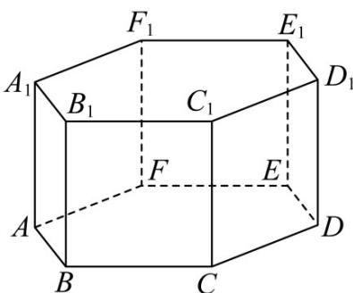

<!-- question-source:start -->
2. 如图，在正六棱柱 $ABCDEF - A_{1}B_{1}C_{1}D_{1}E_{1}F_{1}$ 中.

(1) 化简： $A_{1}F_{1}-EF-BA+FF_{1}+CD+F_{1}A_{1}=$ \_\_\_\_；

(2) 化简： $DE + E_{1}F_{1} + FD + BB_{1} + A_{1}E_{1} =$ \_\_\_\_.
<!-- question-source:end -->

![[高中/课堂同步/题库/人教A版高中数学同步讲义(2026)/03_选择性必修第一册/第一章 空间向量与立体几何/专题1.1 空间向量及其运算（高效培优讲义）/强化训练/questions/answers/Q00079798A1.md]]
