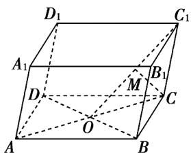

<!-- question-source:start -->
4．如图，在平行六面体 $ABCD - A_1B_1C_1D_1$ 中， $AC$ ， $BD$ 相交于点 $O$ ， $M$ 为 $OC_1$ 的中点，已知 $AB = a$ ， $AD = b$ ， $\overline{AA_1} = c$ ，则 $\overline{CM} = (\quad)$

$$
\frac {1}{4} a + \frac {1}{4} b - \frac {1}{2} c _ {\mathrm{B}} \quad \frac {1}{4} a - \frac {1}{4} b - \frac {1}{2} c _ {\mathrm{C}} \quad - \frac {1}{4} a - \frac {1}{4} b + \frac {1}{2} c _ {\mathrm{D}} \quad - \frac {3}{4} a + \frac {1}{4} b - \frac {1}{2} c
$$
<!-- question-source:end -->

![[高中/课堂同步/题库/人教A版高中数学同步讲义(2026)/03_选择性必修第一册/第一章 空间向量与立体几何/专题1.1 空间向量及其运算（高效培优讲义）/强化训练/questions/answers/Q00079800A1.md]]
