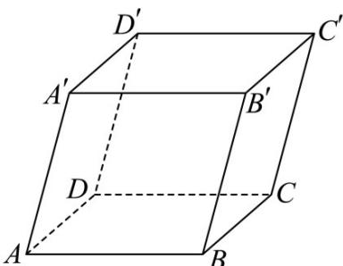

<!-- question-source:start -->
6. 已知平行六面体 $ABCD - A'B'C'D'$ ，化简下列表达式，并在图中标出化简结果的向量：

(1) $\overset{\square\square\square}{DC} + \overset{\square\square\square\square}{A'}D' + \frac{1}{2} CC'$

(2) $AA' + \frac{1}{2} AB + \frac{1}{2} AD$ .
<!-- question-source:end -->

![[高中/课堂同步/题库/人教A版高中数学同步讲义(2026)/03_选择性必修第一册/第一章 空间向量与立体几何/专题1.1 空间向量及其运算（高效培优讲义）/强化训练/questions/answers/Q00079802A1.md]]
