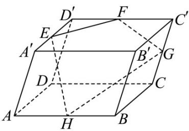

<!-- question-source:start -->
7. 如图，已知平行六面体 $ABCD - A'B'C'D'$ ， $E, F, G, H$ 分别是棱 $A'D', C'D', CC'$ 和 $AB$ 的中点，求证：

$E,F,G,H$

四点共面.

<!-- question-source:end -->

![[高中/课堂同步/题库/人教A版高中数学同步讲义(2026)/03_选择性必修第一册/第一章 空间向量与立体几何/专题1.1 空间向量及其运算（高效培优讲义）/强化训练/questions/answers/Q00079803A1.md]]
