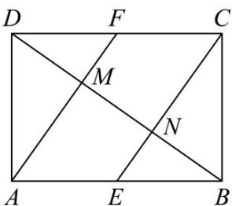
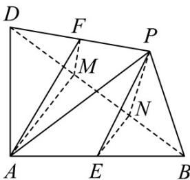

<!-- question-source:start -->
15．如图（1），在长方形ABCD中， $AB=2$ ， $BC=\sqrt{2}$ ，E，F分别为AB，CD的中点，连接AF，CE，分别

交 $BD$ 于点 $M, N$ , 将 $\triangle CBD$ 沿直线 $BD$ 折起到 $\triangle PBD$ 的位置, 如图 (2), 则下列说法正确的是 ( )

图(1)

图(2)

A. 在翻折的过程中，恒有 $BD \perp$ 平面 $PEN$

$$
\sqrt {6}
$$

B．若 G 为直线 PN 上一点，则点 G 到直线 AM 的最短距离为 3

C．当二面角 P-BD-A 的大小为 $\frac{\pi}{3}$ 时， $PA=\sqrt{3}$

D．当平面 $PBD \perp$ 平面 $ABD$ 时，三棱锥 $P - ABD$ 外接球的表面积为 $6\pi$
<!-- question-source:end -->

![[高中/课堂同步/题库/人教A版高中数学同步讲义(2026)/03_选择性必修第一册/第一章 空间向量与立体几何/专题1.1 空间向量及其运算（高效培优讲义）/强化训练/questions/answers/Q00079810A1.md]]
