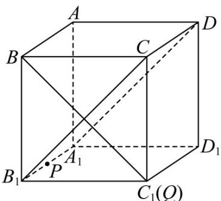

> [!faq]- 《专题1.1 空间向量及其运算（高效培优讲义）》官方解析
>
> > [!success]- **【答案】** $^{1}$
>
> > [!note]- **【分析】**
> > 将点 $P$ 和点 $Q$ 满足的向量式转化，分析得出 $P, Q$ 的位置，然后利用线面垂直的判定以及性质即可求
> >
> > 得答案·
>
> > [!note]- **【解析】**
> > $\overline{AP}=\overline{AA_{1}}+\lambda\overline{AB}\Leftrightarrow\overline{AP}-\overline{AA_{1}}=\lambda\overline{AB}\Leftrightarrow\overline{A_{1}P}=\lambda\overline{AB},$ 又 $\lambda\in[0,2]$
> >
> > 所以点 P 在射线 $A_{1}B_{1}$ 上；
> >
> > $$
> > \stackrel {\square \square \square} {A Q} = \mu A A _ {1} + A B + A D \Leftrightarrow A Q = \mu A A _ {1} + A C \Leftrightarrow A _ {1} Q - A C = \mu A A _ {1} \Leftrightarrow C Q = \mu A A _ {1}, \text {又} \mu \in [ 0, 2 ]
> > $$
> >
> > 所以点 Q 在射线 $CC_{1}$ 上；
> >
> > 
> >
> > 因为当 $\lambda$ 变化时， $DP \subset$ 平面 $A_{1}B_{1}CD$ ，故只需考虑过 B 且与平面 $A_{1}B_{1}CD$ 垂直的线，
> >
> > 因为正方体有 $A_{1}B_{1} \perp$ 平面 $BB_{1}C_{1}C$ ，而 $BC_{1} \subset$ 平面 $BB_{1}C_{1}C$ ，所以 $A_{1}B_{1} \perp BC_{1}$
> >
> > 又 $BC_{1} \perp B_{1}C$ ， $A_{1}B_{1} \cap B_{1}C = B_{1}, A_{1}B_{1}, B_{1}C \subset$ 平面 $A_{1}B_{1}CD$ ，所以 $BC_{1} \perp$ 平面 $A_{1}B_{1}CD$
> >
> > $DP \subset_{平面} A_{1} B_{1} CD$ ，所以 $BC_{1} \perp DP$
> >
> > 所以当点 Q 在 $C_{1}$ 上时 $DP \perp BQ$ ，即 $\mu = 1$ 时 $DP \perp BQ$ ，
> >
> > 故答案为：1.
> >
> > ## 方法技巧
> >
> > 利用共线向量定理可以判定两直线平行、证明三点共线．证平行时，先从直线上取有向线段来表示两个
> > 向量，然后利用向量的线性运算证明向量共线，进而可以得到线线平行，此为证明平行问题的一种重要方法；
> > 证明三点共线问题时，通常不用图形。直接利用向量的线性运算，但一定要注意所表示的向量必须有一个公
> >
> > 共点.
