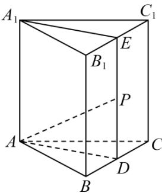

> [!faq]- 《专题1.1 空间向量及其运算（高效培优讲义）》官方解析
>
> > [!success]- **【答案】** ABC
>
> > [!note]- **【分析】**
> > 利用向量的线性运算逐一计算判断即可·
>
> > [!note]- **【解析】**
> > 对于 $^{A}$ ：由 $\overline{BP} = \lambda \overline{BC} + \mu \overline{BB}_{1}, \lambda, \mu \in [0,1]$ ，得点 P 在侧面 $BCC_{1}B_{1}$ 内（含边界），
> >
> > 若 $\lambda = \mu$ ，则 $BP = \lambda \left( BC + BB_1 \right) = \lambda BC_1 (\lambda \in [0,1])$ ，故点 $P$ 的轨迹为线段 $BC_1$ ，故 $\mathsf{A}$ 正确；
> >
> > 对于 B：若 $\lambda + \mu = 1$ ，则 $\overline{BP} = \lambda \overline{BC} + (1 - \lambda) \overline{BB}_{1}$ ，所以 $\overline{BP} - \overline{BB}_{1} = \lambda \left( \overline{BC} - \overline{BB}_{1} \right)$ ，即 $\overline{B}_{1}P = \lambda \overline{B}_{1}C$
> >
> > 又 $\lambda \in [0,1]$ ，故点 $P$ 的轨迹为线段 $B_{1}C$ ，故 ${}^{\mathrm{B}}$ 正确；
> >
> > 对于 C：分别取棱 $BC, B_{1}C_{1}$ 的中点 D, E ，连接 DE ，由题意易证 $BC \perp$ 平面 ADEA
> >
> > 当点 $P$ 在线段 $DE$ 上时， $AP \perp BC$ ，故存在 $\lambda, \mu \in (0,1)$ ，使得 $AP \perp BC$ ，故 $C$ 正确；
> >
> > 对于 D：若使 $AP \parallel$ 平面 $A_{1}B_{1}C_{1}$ ，则点 P 必在棱 BC 上，此时 $\mu = 0$ ，故不存在 $\lambda, \mu \in (0,1)$ ，
> > 使得 $AP \parallel$ 平面 $A_{1}B_{1}C_{1}$ ，故 D 错误·
> >
> > 故选：ABC.
> >
> > 
