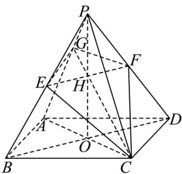

> [!faq]- 《专题1.1 空间向量及其运算（高效培优讲义）》官方解析
>
> > [!success]- **【答案】** ACD
>
> > [!note]- **【解析】**
> > 对 A，连接 AC, BD 交于点 O，连接 PO，因为在正四棱锥 P-ABCD 中，底面 ABCD 为正方形，
> >
> > 所以 $AC \perp BD$ ，又因为 PB = PD，O 为 BD 中点，所以 $PO \perp BD$ ，又因为 $AC \cap PO = O$ ， $AC, PO \subset$ 平面 PAC
> >
> > 所以 $BD \perp$ 平面 PAC ，又因为 $CG \subset$ 平面 PAC ，所以 $CG \perp BD$ ，A 正确；
> >
> > 对 B，因为 PA = PC，O 为 BD 中点，所以 $PO \perp AC$ ，因为 ABCD 为正方形，所以 $AC \perp BD$ ，
> >
> > 又因为 $BD \cap PO = O$ ， $BD, PO \subset$ 平面 PBD，所以 $AC \perp$ 平面 PBD，
> >
> > 则 $AC \perp$ 平面 PEF ，所以当 $\lambda = 0$ ，即点 G 与 P 重合时， $AC \perp$ 平面 GEF ，B 错误；
> >
> > 对 C，连接 GE,FF ，因为平面 GEF // 平面 ABCD ，平面 GEF ∩ 平面 PAB = EG ，平面 ABCD ∩ 平面
> >
> > 所以根据面面平行的性质定理可知 $AB // EG$
> >
> > 又因为 E 分别为 PB 的中点，所以 G 为 PA 中点，所以 $\lambda = \frac{1}{2}$ ，C 正确；
> >
> > 
> >
> > 对 $^{D}$ ，因为 G, E, F, C 四点共面，所以四边形 GEFC 为平面四边形，所以连接 EF, CG 交于点 H，
> > 在 $\triangle PCG$ 中，因为G,H,C共线，所以 $PH=\mu\overline{PC}+(1-\mu)\overline{PG}=(1-\mu)\lambda\overline{PA}+\mu\overline{PC}$
> >
> > 由于对称性可知，H 为 EF 中点，
> >
> > 又因为 $EF // BD, EF = \frac{1}{2} BD,$ 所以 $\boxed{\square\square}\boxed{PH} = \frac{1}{2}\boxed{\square\square} PO = \frac{1}{2}\left[\frac{1}{2}\left(\boxed{\square\square} PA + \boxed{\square\square} PC\right)\right] = \frac{1}{4}\boxed{\square\square} PA + \frac{1}{4}\boxed{\square\square} PC$
> >
> > 所以 $(1-\mu)\lambda PA + \mu PC = \frac{1}{4}PA + \frac{1}{4}PC$
> >
> > 所以 $\left\{\begin{aligned}(1-\mu)\lambda&=\frac{1}{4}\\ \mu&=\frac{1}{4}\end{aligned}\right.$ ，解得 $\lambda=\frac{1}{3}$ ，D 正确；
> >
> > 故选 **ACD**.
