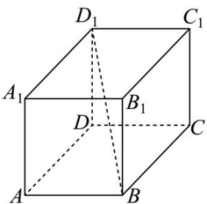

<!-- question-source:start -->
【变式3】如图，在长方体 $ABCD - A_{1}B_{1}C_{1}D_{1}$ 中，设 $AD = 1$ ，则 $\overline{BD_1} \cdot \overline{AD} = (\quad)$

A. 1 B. 2 C. 3 D. $\frac{\sqrt{6}}{3}$
<!-- question-source:end -->

![[高中/课堂同步/题库/人教A版高中数学同步讲义(2026)/03_选择性必修第一册/第一章 空间向量与立体几何/专题1.1 空间向量及其运算（高效培优讲义）/题型04_空间向量的数量积/questions/answers/Q00079784A1.md]]
