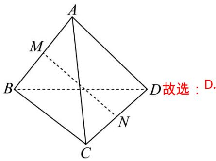

> [!faq]- 《专题1.1 空间向量及其运算（高效培优讲义）》官方解析
>
> > [!success]- **【答案】** D
>
> > [!note]- **【分析】**
> > 利用向量的线性运算可求得 $MN=\frac{1}{2}\left(-a+c+b\right)$ ，可判断 AB； $c\cdot(b+a)=c\cdot b$ ，可判断 C；由 $CB \perp CD$ ，可得 $b^{2}=b\cdot c+a\cdot b$ ，进而计算可得 $b\cdot(c+a)=b^{2}$ ，可判断 D.
>
> > [!note]- **【解析】**
> > 因为 $AB \perp AD$ ，所以 $c\cdot a=0$ ，所以 $c\cdot(b+a)=c\cdot b+c\cdot a=c\cdot b$ 不一定等于 $c^{2}$ ，故 C 错误；
> >
> > 因为 $CB \perp CD$ ，所以 $CB \perp CD$ ，所以 $CB\cdot CD=0$ ，
> >
> > 所以 $(a-b)\cdot(c-b)=a\cdot c-a\cdot b-b\cdot c+b^{2}=-a\cdot b-b\cdot c+b^{2}=0$ ，所以 $b^{2}=b\cdot c+a\cdot b$ ，
> >
> > 所以 $b\cdot(c+a)=b\cdot c+b\cdot a=b^{2}$ ，故 D 正确。
> >
> > 
> >
> > ## 方法技巧
> >
> > 向量的数量积运算除不满足乘法结合律外，其它都满足，所以其运算和实数的运算基本相同。求空间向
> >
> > 量数量积的运算同平面向量一样，关键在于确定两个向量之间的夹角以及它们的模，利用公式：
> >
> > $a \cdot b = |a| \cdot |b| \cdot \cos \langle a, b \rangle$ 即可顺利计算.
