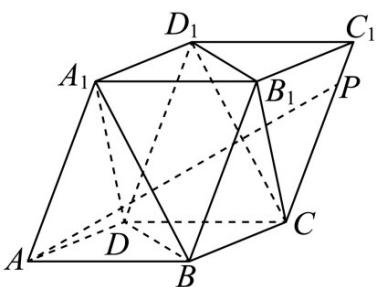

<!-- question-source:start -->
【典例1】如图，在平行六面体 $ABCD - A_{1}B_{1}C_{1}D_{1}$ 中，向量 $\stackrel{\mathrm{uuu}}{AA}_{1}$ ， $\stackrel{\mathrm{uuu}}{AD}$ ， $\stackrel{\mathrm{uuu}}{AB}$ 的模长均为 $2$ ，且它们彼此的夹角

都是 $60^{\circ}$ 动点 $P$ 在棱 $CC_{1}$ 上，则（）

A. $AC_{1}=2\sqrt{6}$ B. 直线 BD 与直线 AP 所成角为 $90^{\circ}$

C．平面 $BDD_{1}B_{1}$ 与平面 ABCD 的夹角为 $60^{\circ}D$ ．多面体 $A_{1}B_{1}D_{1}-BCD$ 的外接球体积为 $\frac{8\sqrt{2}}{3}\pi$
<!-- question-source:end -->

![[高中/课堂同步/题库/人教A版高中数学同步讲义(2026)/03_选择性必修第一册/第一章 空间向量与立体几何/专题1.1 空间向量及其运算（高效培优讲义）/题型05_利用空间向量的数量积求两向量的夹角/questions/answers/Q00079785A1.md]]
