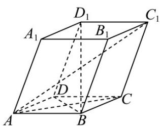

<!-- question-source:start -->
【变式2】如图，在平行六面体 $ABCD - A_{1}B_{1}C_{1}D_{1}$ 中，以顶点 $A$ 为端点的三条棱长均为3，且它们彼此的夹角

都是 $60^{\circ}$ ，则对角线 $AC_{1}$ 长为（）

A. $3\sqrt{6}$ B. $3\sqrt{2}$ C. $3\sqrt{3}$ D. 6
<!-- question-source:end -->

![[高中/课堂同步/题库/人教A版高中数学同步讲义(2026)/03_选择性必修第一册/第一章 空间向量与立体几何/专题1.1 空间向量及其运算（高效培优讲义）/题型05_利用空间向量的数量积求两向量的夹角/questions/answers/Q00079787A1.md]]
