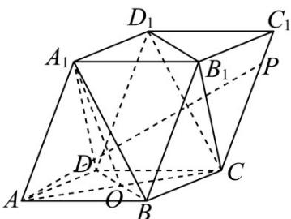
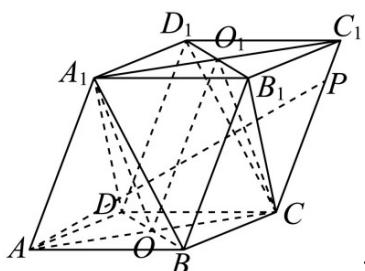
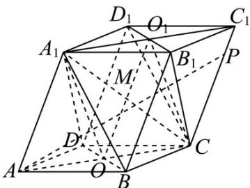
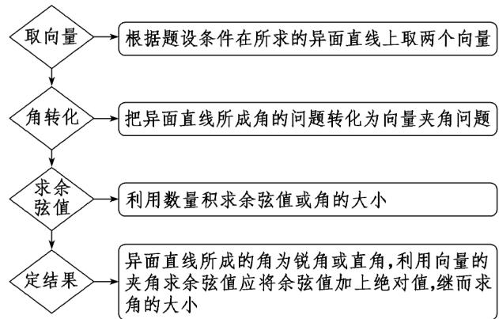

> [!faq]- 《专题1.1 空间向量及其运算（高效培优讲义）》官方解析
>
> > [!success]- **【答案】** ABD
>
> > [!note]- **【解析】**
> > 在平行六面体 $ABCD-A_{1}B_{1}C_{1}D_{1}$ 中， $AC_{1}=AB+AD+AA_{1}$
> >
> > 向量 $AA_{1}$ ， $AD$ ， $AB$ 的模长均为 $^{2}$ ，且它们彼此的夹角都是 $60^{\circ}$
> >
> > 所以 $|\overline{A}C_1|^2 = |\overline{A}B|^2 + |\overline{A}D|^2 + |\overline{A}A_1|^2 + 2\overline{A}B \cdot \overline{A}D + 2\overline{A}B \cdot \overline{A}A_1 + 2\overline{A}D \cdot \overline{A}A_1$
> >
> > $= 2^{2} + 2^{2} + 2^{2} + 2 \times 2 \times 2 \times \frac{1}{2} + 2 \times 2 \times 2 \times \frac{1}{2} + 2 \times 2 \times 2 \times \frac{1}{2} = 24$ 即 $|AC_{1}| = 2\sqrt{6}$ ，故 A 正确；
> >
> > 对于 B，连接 AC 交 BD 于 O，连接 $A_{1}O$
> >
> > 
> >
> > 由题知 $AB = AD$ ， $\angle BAD = 60^{\circ}$ ，所以 $\triangle ABD$ 为等边三角形，四边形ABCD为菱形，∴ $BD\perp AC$
> >
> > 同理可得 $\triangle ABA_{1}$ ， $\triangle ADA_{1}$ 也为等边三角形，即 $\triangle BDA_{1}$ 也为等边三角形， $BD\perp A_{1}O$
> >
> > 又 $AC \cap A_{1}O = O$ ， $AC, A_{1}O \subset$ 平面 $AA_{1}C$ ， $BD \perp$ 平面 $AA_{1}C$ ，即 $BD \perp$ 平面 $AA_{1}C_{1}C$
> >
> > ∵ $AP \subset_{平面} AA_{1}C_{1}C$ ，∴ $BD \perp AP$ ，故 B 正确；
> >
> > 对于 C，连接 $A_{1}C_{1}$ 交 $B_{1}D_{1}$ 于 $O_{1}$ ，连接 $OO_{1}$ ， $O_{1}C$
> >
> > 
> >
> > 平面 ， 平面 ，
> >
> > $\because BD \perp AA_{1}C_{1}C \quad OO_{1} \subset AA_{1}C_{1}C \quad BD \perp OO_{1}$
> >
> > 又 $BD \perp AC$ ，平面 $BDD_{1}B_{1} \cap$ 平面 $ABCD = BD$ ，所以 $\angle COO_{1}$ 就是平面 $BDD_{1}B_{1}$ 与平面 $ABCD$ 的夹角，
> >
> > 在平行六面体 $ABCD - A_{1}B_{1}C_{1}D_{1}$ 中， $OO_{1} = AA_{1} = 2$ ， $\because \triangle ABD$ ， $\triangle BDA_{1}$ 为等边三角形，
> >
> > $\therefore AO = OC = \sqrt{3}$ ， $A_{1}O = O_{1}C = \sqrt{3}$ ， $\angle COO_{1} = \frac{OO_{1}^{2} + OC^{2} - O_{1}C^{2}}{2OO_{1}\cdot OC} = \frac{4 + 3 - 3}{4\sqrt{3}} = \frac{\sqrt{3}}{3}$ ，故C错误；
> >
> > 对于 D，连接 $A_{1}C$ 交 $OO_{1}$ 于 M，M 为 $A_{1}C$ 、 $OO_{1}$ 中点，
> >
> > 
> >
> > 又 $BB_{1} = DD_{1} = BD = B_{1}D_{1} = 2$ ， $BD\bot OO_{1}$ ，所以四边形 $BB_{1}D_{1}D$ 为正方形，
> >
> > $$
> > M B = M D = M B _ {1} = M D _ {1} = \sqrt {2} \text {, 又} \angle A _ {1} A C = \angle O _ {1} O C
> > $$
> >
> > 所以 $A_{1}C = \sqrt{AA_{1}^{2} + AC^{2} - 2AA_{1}\cdot AC\cos\angle A_{1}AC} = \sqrt{4 + 12 - 8\sqrt{3}\times\frac{\sqrt{3}}{3}} = 2\sqrt{2}$ ，即 $MA_{1} = MC = \sqrt{2}$
> >
> > 所以多面体 $A_{1}B_{1}D_{1} - BCD$ 外接球球心在 $OO_{1}$ 中点 $M$ 处，半径 $R = \sqrt{2}$ ，体积 $V = \frac{4}{3}\pi R^3 = \frac{8\sqrt{2}}{3}$ ，故 D 正确；
> >
> > 故选：ABD.
> >
> > ## 方法技巧
> >
> > 1、求两个向量的夹角有两种方法：
> > - **①**：结合图形，平移向量，利用空间向量夹角的定义来求，但要注意向量夹角的范围；
> >
> > 
> > - **②**：先求 $a \cdot b$ ，再利用公式 $\cos \langle a, b \rangle = \frac{a \square b}{|a||b|}$ 求出 $\cos \langle a, b \rangle$ 的值，最后确定 $\langle a, b \rangle$ 的值。
> >
> > 2、利用数量积求夹角或其余弦值的步骤
> >
> > 根据题设条件在所求的异面直线上取两个向量
> >
> > 把异面直线所成角的问题转化为向量夹角问题
> >
> > 利用数量积求余弦值或角的大小
> >
> > 异面直线所成的角为锐角或直角,利用向量的夹角求余弦值应将余弦值加上绝对值,继而求角的大小
> >
> > 注：求两向量夹角，必须特别关注两向量方向，应用向量夹角定义确定夹角是锐角、直角还是钝角.
