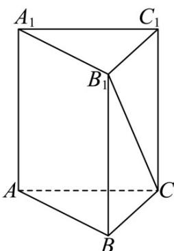

> [!faq]- 《专题1.1 空间向量及其运算（高效培优讲义）》官方解析
>
> > [!success]- **【答案】** $\frac{3\sqrt{13}}{13}/\frac{3}{13}\sqrt{13}$
>
> > [!note]- **【解析】**
> > 因为 $AB_{1} \cdot BC + AC_{1} \cdot CB = AB_{1} \cdot BC - AC_{1} \cdot BC = (AB_{1} - AC_{1}) \cdot BC = C_{1}B_{1} \cdot BC = -4$ 所以 $-BC^{2} = -4$ ，所以 $\left|BC\right| = 2$
> >
> > 
> >
> > 由三棱柱的结构特点可知 $AA_{1} / / BB_{1}$ ，所以异面直线 $AA_{1}$ 与 $B_{1}C$ 的夹角即为 $\angle BB_{1}C$ （锐角），
> >
> > 因为 $BC = 2, BB_{1} = AA_{1} = 3, \angle B_{1}BC = \frac{\pi}{2}$ ，所以 $B_{1}C = \sqrt{BC^{2} + BB_{1}^{2}} = \sqrt{13}$ ，
> >
> > 所以 $\cos\angle BB_{1}C=\frac{BB_{1}}{B_{1}C}=\frac{3\sqrt{13}}{13}$ ，所以异面直线 $AA_{1}$ 与 $B_{1}C$ 的夹角的余弦值为 $\frac{3\sqrt{13}}{13}$ ，故答案为： $\frac{3\sqrt{13}}{13}$
