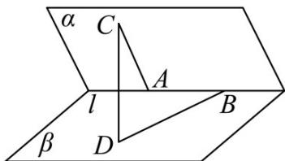

<!-- question-source:start -->
【典例1】如图，二面角 $\alpha - l - \beta$ 的棱上有两个点 $A, B$ ，线段 $BD$ 与 $AC$ 分别在这个二面角两个面内，并且都

垂直于棱 $l$ .若二面角 $\alpha -l - \beta$ 的平面角为 $\frac{\pi}{3}$ ，且 $AB = 4$ ， $AC = 6$ ， $BD = 8$ ，则 $CD$ 的长度为（ ）.

A. $2\sqrt{71}$ B. $2\sqrt{41}$ C. $2\sqrt{17}$ D. $2\sqrt{14}$
<!-- question-source:end -->

![[高中/课堂同步/题库/人教A版高中数学同步讲义(2026)/03_选择性必修第一册/第一章 空间向量与立体几何/专题1.1 空间向量及其运算（高效培优讲义）/题型06_利用空间向量的数量积求线段的长度/questions/answers/Q00079789A1.md]]
