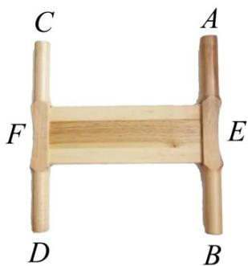
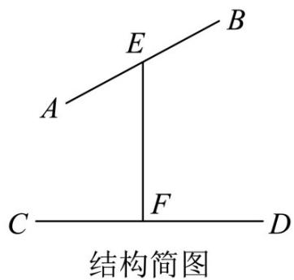

<!-- question-source:start -->
【变式2】如图，这是缠线用的线拐子，在结构简图中，线段 $AB$ 与线段 $CD$ 所在直线异面垂直， $E$ ， $F$ 分别

为 $AB$ ， $CD$ 的中点，且 $EF\perp AB$ ， $EF\perp CD$ ．使用线拐子时使丝线从点 $A$ 出发，依次经过 $D$ ， $B$ ， $C$ ，又回到

点 $A$ .这样一直循环，丝线缠好后从线拐子上脱下，这称为“束丝”.若图中 $AB = EF = CD = 10\mathrm{cm}$ ，则丝线缠

一圈的长度为（）

A. $20\sqrt{6}\mathrm{cm}$ B. $20\sqrt{3}\mathrm{cm}$ C. $60\sqrt{2}\mathrm{cm}$ D. $60\sqrt{3}\mathrm{cm}$
<!-- question-source:end -->

![[高中/课堂同步/题库/人教A版高中数学同步讲义(2026)/03_选择性必修第一册/第一章 空间向量与立体几何/专题1.1 空间向量及其运算（高效培优讲义）/题型06_利用空间向量的数量积求线段的长度/questions/answers/Q00079791A1.md]]
