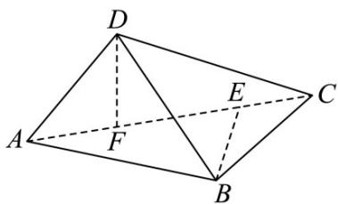

> [!faq]- 《专题1.1 空间向量及其运算（高效培优讲义）》官方解析
>
> > [!success]- **【答案】** ACD
>
> > [!note]- **【解析】**
> > 对于 A，由题意得 $AB^{2} + BC^{2} = AC^{2}, AD^{2} + CD^{2} = AC^{2}$ ，所以 $\angle ADC = \angle ABC = 90^{\circ}$
> >
> > 分别过 B, D 作 AC 的垂线，垂足分别为 E, F
> >
> > 
> >
> > 则
> >
> > $$
> > B E = F D = \frac {\sqrt {3}}{2}, E F = 1
> > $$
> >
> > ，且
> >
> > $$
> > \stackrel {{\text { U   U   U }}} {{B D}} = \stackrel {{\text { U   U   U }}} {{B E}} + \stackrel {{\text { U   U   U }}} {{E F}} + \stackrel {{\text { U   U   U }}} {{F D}}
> > $$
> >
> > 因为平面 $DAC \perp$ 平面 ABC ，平面 $DAC \cap$ 平面 ABC = AC ， $BE \subset$ 平面 ABC ，
> >
> > 所以 $BE \perp$ 平面 DAC，又 $DF \subset$ 平面 DAC，所以 $BE \perp DF$ ，
> >
> > 故 $\overline{BD}^2 = (\overline{BE} +\overline{EF} +\overline{FD})^2 = \overline{BE}^2 +\overline{EF}^2 +\overline{FD}^2 +2\overline{BE}\cdot \overline{EF} +2\overline{EF}\cdot \overline{FD} +2\overline{FD}\cdot \overline{BE}$
> >
> > $= \frac{3}{4} + 1 + \frac{3}{4} + 0 + 0 + 0 = \frac{5}{2}$ 所以 $BD = \frac{\sqrt{10}}{2}$ ，故A正确；
> >
> > 对于 B，因为 $\angle ADC = \angle ABC = 90^{\circ}$ ，故 AC 的中点到 A, B, C, D 的距离相等，
> >
> > 故球心 $O$ 为 $AC$ 的中点，且球 $O$ 的半径为 $1$ ，故球 $O$ 的表面积为 $4\pi$ ，为定值，故 ${}^{\mathrm{B}}$ 错误；
> >
> > 对于 C，假设 $AB \perp CD$ ，又 $AB \perp BC, BC \cap CD = C, BC, CD \subset$ 平面 BCD，
> >
> > 所以 $AB \perp$ 平面 BCD ，又 $BD \subset$ 平面 BCD ，所以 $AB \perp BD$ ，
> >
> > 所以 $\triangle ABD$ 是以 AD 为斜边的直角三角形，所以 AD > AB ，与已知矛盾，
> >
> > 所以异面直线 AB 与 CD 不可能垂直，故 C 正确；
> >
> > 对于 $D$ ，设 $AD$ 与平面 $ABC$ 所成角为 $\theta$ ，点 $D$ 到平面 $ABC$ 的距离为 $d$ ，
> >
> > 则 $\sin \theta = \frac{d}{AD} = d$ ，所以当点 $D$ 到平面 $ABC$ 的距离最大时， $AD$ 与平面 $ABC$ 所成角最大，
> >
> > 当平面 $DAC \perp$ 平面 ABC 时，点 D 到平面 ABC 的距离最大，
> >
> > 此时 $d_{\max}=DF=\frac{\sqrt{3}}{2}$ ，即 $(\sin\theta)_{\max}=\frac{\sqrt{3}}{2}$ ，所以 $\theta_{\max}=60^{\circ}$ ，故 D 正确·故选：ACD.
> >
> > ## 方法技巧
> >
> > 利用空间向量解决垂直问题的方法
> >
> > (1)证明线线垂直的方法：证明线线垂直的关键是确定直线的方向向量，看方向向量的数量积是否为0来判断两直线是否垂直.
> >
> > (2)证明与空间向量 $a, b, c$ 有关的向量 $m, n$ 垂直的方法：先用向量 $a, b, c$ 表示向量 $m, n$ ，再求解向量
> >
> > m, n 的数量积并判断是否为 0.
