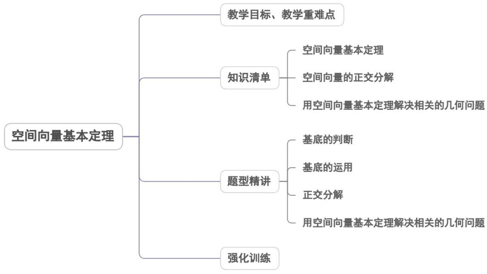

<!-- source-part:1 pages:1-40 -->

## 专题1.2 空间向量基本定理

## 内容概览

## 教学目标、教学重难点

<table><tr><td>教学目标</td><td>1.理解并记住共线向量基本定理、平面向量基本定理、共面向量定理及空间向量基本定理的内容及含义..2.理解基底与基向量的含义,会用恰当的基向量表示空间任意向量.3.会用相关的定理解决简单的空间几何问题.</td></tr><tr><td>教学重难点</td><td>1.重点通过对空间向量基本定理的意义的掌握与了解,会用空间向量的基底表示空间任一向</td></tr></table>

量，能用正交分解及坐标形式表示空间向量.

2.难点

## 知识清单

## 知识点 01 空间向量基本定理

如果空间中的三个向量 $a$ ， $b$ ， $c$ 不共面，那么对空间中的任意一个向量 $p$ ，存在唯一的有序实数组 $(x, y, z)$ 使得 $p = xa + yb + zc$ 。其中，空间中不共面的三个向量 $a$ ， $b$ ， $c$ 组成的集合 $\{a, b, c\}$ ，常称为空间向量的一组基底。此时， $a$ ， $b$ ， $c$ 都称为基向量；如果 $p = xa + yb + zc$ ，则称 $xa + yb + zc$ 为 $p$ 在基底 $\{a, b, c\}$ 下的分解式。

## 【即学即练】

1. 关于空间向量，以下说法正确的是（ ）

【答案】
A．空间中的三个向量，若有两个向量共线，则这三个向量一定共面
B．若 $a \cdot b > 0$ ，则 $\left\langle a, b \right\rangle$ 是锐角
C．已知向量组 $\left\{a, b, c\right\}$ 是空间的一个基底，则 $\left\{2a, b, c - a\right\}$ 也是空间的一个基底
D．已知 A, B, C 不共线，对空间任意一点 O，若 $OP = \frac{3}{4}OA + \frac{1}{8}OB + \frac{1}{8}OC$ ，则 P, A, B, C 四点共面

【答案】 ACD

【分析】根据空间向量共面定理即可判断 $^{A}$ ；根据 $a\cdot b>0$ 可得 $0\leq\left\langle a,b\right\rangle<\frac{\pi}{2}$ 判断 $^{B}$ ；运用反证法思想说明

$2a, b, c - a$ 不共面即可判断 $C$ ；根据空间向量共面定理的推论即可判断 $D$ .

【详解】对于 $A$ ，根据空间向量共面定理知：空间中三个向量，若有两个向量共线，则这三个向量一定共面，

故 $^{A}$ 正确；

对于 B，由 $a \cdot b > 0$ ，可得 $\cos\langle a, b \rangle > 0$ ，因 $0 \leq \langle a, b \rangle \leq \pi$ ，则 $0 \leq \langle a, b \rangle < \frac{\pi}{2}$ ，故 B 错误；

对于 C，假设 2a, b, c - a 共面，则存在 $\lambda, \mu \in R$ ， $b = \lambda \cdot 2a + \mu(c - a) = (2\lambda - \mu)a + \mu c$

因向量组 $\left\{\begin{array}{cc}r & r \\ a, b, c\end{array}\right\}$ 是空间的一个基底，故不存在 $\lambda, \mu \in R$ 使得 $b = (2\lambda - \mu)a + \mu c$ 成立，

故假设不成立， $\{2a,b,c - a\}$ 不共面，即 $\{2a,b,c - a\}$ 也是空间的一个基底，故 $^C$ 正确；

对于 $^{D}$ ，因 $OP=\frac{3}{4}OA+\frac{1}{8}OB+\frac{1}{8}OC$ ，且 $\frac{3}{4}+\frac{1}{8}+\frac{1}{8}=1$ ，故 P, A, B, C 四点共面，即 $^{D}$ 正确。

故选：ACD.

2．如图，在平行六面体 $ABCD - A_1B_1C_1D_1$ 中，设 $a = AA_{1}$ ， $b = DB_{1}$ ，若 $a$ 、 $b$ 、 $c$ 组成空间向量的一个基底，

则 $c$ 可以是（ ）

A $\overset{\cup\cup\cup}{BB_{1}}$ B $\overset{\cup\cup\cup}{BC_{1}}$ C $\overset{\cup\cup\cup}{BD}$ D $\overset{\cup\cup\cup}{BD_{1}}$

【答案】B

【分析】利用平行六面体的结构特征，结合空间共面向量定理爱空间向量基本定理逐项判断·

【详解】由 $a = AA_{1}$ ， $b = DB_{1}$ ， $a$ 、 $b$ 、 $c$ 组成空间向量的一个基，得向量 $a$ 、 $b$ 、 $c$ 不共面，对于 $\mathsf{A}$ ，在平行六面体 $ABCD - A_{1}B_{1}C_{1}D_{1}$ 中， $\overline{BB}_{1} = AA_{1}$ ，则 $\overline{BB}_{1}$ 与 $a$ 、 $b$ 共面， $\mathsf{A}$ 不是；

对于 C， $BD = BB_{1} + B_{1}D = AA_{1} - DB_{1} = a - b$ ，BD 与 a、b 共面，C 不是；

对于 D， $\overline{BD_{1}}=\overline{BD}+\overline{DD_{1}}=a-b+a=2a-b,\quad\overline{BD_{1}}$ 与 a、b 共面，D 不是；

对于 B，由 $\overline{DB}_{1} = \overline{DA} + \overline{DC} + \overline{DD}_{1}$ ，得 $b = \overline{DA} + \overline{DC} + a$ ， $\overline{DA}, \overline{DC}, a$ 不共面，

假设 $BC_{1}$ 与 $a$ 、 $b$ 共面，则存在 $x, y \in \mathbb{R}$ ，使得 $BC_{1} = xa + yb$

而 $BC_{1} = CC_{1} - CB = a - DA$ ，则 $a - DA = xa + y(DA + DC + a)$ ，

整理得 $(x+y-1)a+(y+1)\overline{DA}+y\overline{DC}=0$ ，从而 $\left\{\begin{aligned}x+y-1&=0\\ y+1&=0\\ y&=0\end{aligned}\right.$ ，此方程组无解，

假设不成立，因此 $\overset{\square\square}{BC}_{1}$ 与a、b不共面，c可以是 $\overset{\square\square}{BC}_{1}$

故选：B

## 知识点 02 空间向量的正交分解

单位正交基底：如果空间的一个基底中的三个基向量两两垂直，且长度都为1，那么这个基底叫做单位正交基底，常用 $\{i,j,k\}$ 表示.

正交分解：把一个空间向量分解为三个两两垂直的向量，叫做把空间向量进行正交分解.

## 【即学即练】

1. 关于空间向量，以下说法正确的是（ ）

【答案】
A．非零向量a,b，若 $a\cdot b=0$ ，则 $a\perp b$ B．若对空间中任意一点O，有 $OP=\frac{1}{6}OA+\frac{1}{3}OB+\frac{1}{2}OC$ ，则P,A,B,C四点共面
C．设 $\left\{a,b,c\right\}$ 是空间中的一组基底，则 $\left\{a-b,b+c,a+c\right\}$ 也是空间的一组基底
D．已知 $a=(0,1,1),b=(0,0,-1)$ ，则a在b上的投影向量为 $\left(0,-\frac{1}{2},-\frac{1}{2}\right)$

【答案】AB

【分析】对于 $A$ ，由数量积的定义即可判断，对于 $BC$ ，根据空间向量的共面定理及推论，对于 $D$ ，根据投影

向量的计算公式可判断；

【详解】对于 A， $a \cdot b = |a| \cdot |b| \cos \theta = 0$ ，可得 $\theta = \frac{\pi}{2}$ ，正确；

对于 $^{B}$ ，对于空间中任意一点O，由

因为 $\frac{1}{6} +\frac{1}{3} +\frac{1}{2} = 1$ ，所以 $P,A,B,C$ 四点共面，正确；

对于 C，由 $a-b=a+c-(b+c)$ ，可知 $\left\{a-b,b+c,a+c\right\}$ 共面，错误；

对于 $\mathbb{D}$ ，因为向量 $a = (0,1,1),b = (0,0, - 1)$ ，可得 $a\cdot b = -1,\left|b\right| = 1$

所以 $a$ 在 $b$ 上的投影向量为 $\frac{a \cdot b}{|b|} \cdot \frac{b}{|b|} = -\vec{b} = (0, 0, 1)$ ，错误；

故选：AB

2. 对于三元点集 $\Omega = \{P_1, P_2, P_3\}$ ，若对任意一个空间向量 $p$ ，存在唯一的有序实数组 $(\lambda_1, \lambda_2, \lambda_3)$ ，使得 $p = \lambda_1^{OP_1} + \lambda_2^{OP_2} + \lambda_3^{OP_3}$ ，则称 $\Omega$ 为“空间基本点集”·下列集合是“空间基本点集”的是（）

【答案】
A. $\{(0,0,0), (1,0,0), (0,1,0)\}$ B. $\{(1,0,0), (-1,0,0), (0,0,-1)\}$ C. $\{(0,1,0), (0,1,-1), (0,-1,1)\}$ D. $\{(1,0,0), (0,-1,0), (0,0,-1)\}$

【答案】D

【分析】对于 ABC，由空间向量基底概念可判断各选项正误.

对于 $^{D}$ ，由题目中所提供信息可得答案·

【详解】根据空间向量基本定理及题意知这三个向量 $OP_{1}$ ， $OP_{2}$ ， $OP_{3}$ 不共面，即这三个向量能构成空间的一

个基底·

对于 $^{A}$ ，三个向量 $(0,0,0)$ ， $(1,0,0)$ ， $(0,1,0)$ 对应坐标的竖坐标相同且为 $^{0}$ ，则三个向量都在平面 $xOy$ 上，即

三个向量共面，故 $^{A}$ 错误；

对于 $^{B}$ ，三个向量 $(1,0,0)$ ， $(-1,0,0)$ ， $(0,0,-1)$ 对应坐标的纵坐标相同且为 $^{0}$ ，则三个向量都在平面xOz上，

即三个向量共面，故 $^{B}$ 错误；

对于 $C$ ，三个向量 $\left(0,1,0\right)$ ， $(0,1, - 1)$ ， $(0, - 1,1)$ 对应坐标的横坐标相同且为 $^0$ ，则三个向量都在平面 $yOz$ 上，

即三个向量共面，故 $^{C}$ 错误；

对于 $\mathsf{D}$ ，设空间中任意向量为 $p = (x,y,z)$ $\overline{OP_1} = (1,0,0)\overline{OP_2} = (0, - 1,0)\overline{OP_3} = (0,0, - 1)$

则存在唯一的有序实数组 $(x,-y,-z)$ ，使 $p=xOP_{1}-yOP_{2}-zOP_{3}$

则 $\left\{(1,0,0),(0,-1,0),(0,0,-1)\right\}$ 为“空间基本点集”，故 D 正确

故选：D

## 知识点 03 用空间向量基本定理解决相关的几何问题

用已知向量表示某一向量的三个关键点：

(1)用已知向量来表示某一向量，一定要结合图形，以图形为指导是解题的关键.

(2)要正确理解向量加法、减法与数乘运算的几何意义，如首尾相接的若干向量之和，等于由起始向量的始点

指向末尾向量的终点的向量.

(3)在立体几何中三角形法则、平行四边形法则仍然成立

## 【即学即练】

1. 设 $e_1, e_2, e_3$ 不共面，已知 $AB = \lambda e_1 + 2e_2 + e_3$ ， $BC = 3e_1 + 2e_2 + \mu e_3$ ， $CD = 3e_1 - 2e_2 + e_3$ ，若A，C，D三点共线，则 $\lambda -\mu = (\quad)$ A.6 B.12 C.-6 D.-12

【答案】C

【分析】首先表示出 $\overline{AC}$ ，由A，C，D三点共线，可得 $\overline{AC}//\overline{CD}$ ，则则存在实数t使得 $\overline{AC}=t\overline{CD}$ ，根据空

间向量基本定理得到方程组，解得即可·

【详解】因为 $AB = \lambda e_1 + 2e_2 + e_3$ ， $BC = 3e_{1} + 2e_{2} + \mu e_{3}$ ， $CD = 3e_{1} - 2e_{2} + e_{3}$

所以 $AC = AB + BC = \lambda e_{1} + 2e_{2} + e_{3} + 3e_{1} + 2e_{2} + \mu e_{3} = (\lambda + 3)e_{1} + 4e_{2} + (\mu + 1)e_{3}$

又 A，C，D 三点共线，所以 $AC \parallel CD$ ，

则存在实数 $t$ 使得 $\overline{AC} = t\overline{CD}$ ，即 $\left(\lambda +3\right)e_1 + 4e_2 + \left(\mu +1\right)e_3 = t\left(3e_1 - 2e_2 + e_3\right)$

又 $e_{1}$ ， $e_{2}$ ， $e_{3}$ 不共面，

所以 $\left\{\begin{aligned}\lambda+3=3t\\ 4=-2t\\ \mu+1=t\end{aligned}\right.$ ，解得 $\left\{\begin{aligned}\lambda=-9\\ t=-2\\ \mu=-3\end{aligned}\right.$ ，所以 $\lambda-\mu=-6$

故选：C

2．已知空间向量 $a$ ， $b$ ， $c$ ， $p$ ，若存在实数组 $(x_{1},y_{1},z_{1})$ 和 $(x_{2},y_{2},z_{2})$ ，满足 $p = x_{1}a + y_{1}b + z_{1}c$

$p = x_{2}a + y_{2}b + z_{2}c$ ，则下列说法正确的是（）

A. 若 $x_{1} \neq x_{2}$ , 则 $a, b, c$ 共面

B. 若 $a, b, c$ 共面，则 $x_{1} \neq x_{2}$

C．若 $a$ ， $b$ ， $c$ 不共面，则 $x_{1} = x_{2}$ ， $y_{1} = y_{2}$ ， $z_{1} = z_{2}$

D. 若 $a$ ， $b$ ， $c$ 共面，则 $x_{1} + y_{1} + z_{1} = x_{2} + y_{2} + z_{2} = 1$

【答案】AC

【分析】根据空间向量共面定理判断 A，利用特殊值判断 B、D，根据空间向量基本定理判断 C.

【详解】对于 A：因为 $p = x_{1}a + y_{1}b + z_{1}c$ ， $p = x_{2}a + y_{2}b + z_{2}c$ ，

所以 $\left(x_{1} - x_{2}\right)a + \left(y_{1} - y_{2}\right)b + \left(z_{1} - z_{2}\right)c = 0$

因为 $x_{1} \neq x_{2}$ ，所以 $a = -\left(\frac{y_{1} - y_{2}}{x_{1} - x_{2}}\right)b - \left(\frac{z_{1} - z_{2}}{x_{1} - x_{2}}\right)c$ ，

所以向量 $a$ ， $b$ ， $c$ 共面，故 $\mathsf{A}$ 正确.

对于 B、D：若 $a=0,\quad b=(1,0,0),\quad c=(0,0,1)$ ，则 $a,b,c$ 共面，

令 $p = (2,0,2)$ ，则 $p = x_{1}a + 2b + 2c$ ， $p = x_{2}a + 2b + 2c$ ， $x_{1}$ ， $x_{2}$ 可为任意实数，

此时由 $p = x_{1}a + y_{1}b + z_{1}c$ ， $p = x_{2}a + y_{2}b + z_{2}c$

得不到 $x_{1} \neq x_{2}$ ，也得不到 $x_{1} + y_{1} + z_{1} = x_{2} + y_{2} + z_{2} = 1$ ，故 B、D 错误；

对于 $\mathsf{C}$ ：若 $a$ ， $b$ ， $c$ 不共面，由 $p = x_{1}a + y_{1}b + z_{1}c$ ， $p = x_{2}a + y_{2}b + z_{2}c$

则 $x_{1} = x_{2}$ ， $y_{1} = y_{2}$ ， $z_{1} = z_{2}$ ，故C正确；

故选：AC

## 题型精讲

![[高中/课堂同步/题库/人教A版高中数学同步讲义(2026)/03_选择性必修第一册/第一章 空间向量与立体几何/专题1.2 空间向量基本定理（高效培优讲义）/题型01_基底的判断/题型01_基底的判断.md]]
![[高中/课堂同步/题库/人教A版高中数学同步讲义(2026)/03_选择性必修第一册/第一章 空间向量与立体几何/专题1.2 空间向量基本定理（高效培优讲义）/题型02_基底的运用/题型02_基底的运用.md]]
![[高中/课堂同步/题库/人教A版高中数学同步讲义(2026)/03_选择性必修第一册/第一章 空间向量与立体几何/专题1.2 空间向量基本定理（高效培优讲义）/题型03_正交分解/题型03_正交分解.md]]
![[高中/课堂同步/题库/人教A版高中数学同步讲义(2026)/03_选择性必修第一册/第一章 空间向量与立体几何/专题1.2 空间向量基本定理（高效培优讲义）/题型04_用空间向量基本定理解决相关的几何问题/题型04_用空间向量基本定理解决相关的几何问题.md]]
![[高中/课堂同步/题库/人教A版高中数学同步讲义(2026)/03_选择性必修第一册/第一章 空间向量与立体几何/专题1.2 空间向量基本定理（高效培优讲义）/强化训练/强化训练.md]]
