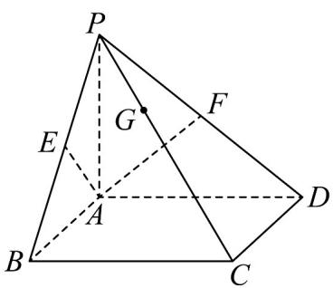

<!-- question-source:start -->
4.如图，在四棱锥 $P - ABCD$ 中，底面 $ABCD$ 为平行四边形，点 $E,F$ 分别为 $PB,PD$ 的中点，若 $\frac{1}{2} PG = \frac{1}{2} GC$

且 $AG = xAE + yAF$ ，则 $x + y = (\quad)$

A. 1 B. 2 C. $\frac{3}{2}$ D. $\frac{4}{3}$
<!-- question-source:end -->

![[高中/课堂同步/题库/人教A版高中数学同步讲义(2026)/03_选择性必修第一册/第一章 空间向量与立体几何/专题1.2 空间向量基本定理（高效培优讲义）/强化训练/questions/answers/Q00079830A1.md]]
