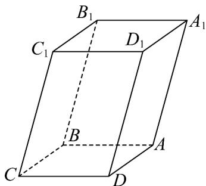

<!-- question-source:start -->
8. 如图，已知平行六面体 $ABCD - A_{1}B_{1}C_{1}D_{1}$ 中，底面 $ABCD$ 是边长为 1 的正方形，

$$
A A _ {1} = 2, \angle A _ {1} A B = \angle A _ {1} A D = 1 2 0 ^ {\circ} \text {设} \stackrel {{\mathrm{UUU}}} {{A B}} = a \stackrel {{\mathrm{UUU}}} {{A D}} = b \stackrel {{\mathrm{UUU}}} {{A A}} _ {1} = c
$$

(1)试用 a, b, c 表示向量 $AC_{1}$ , $BD_{1}$

(2)求 $\left|AC_{1}\right|$ ;

(3)求证： $AA_{1} \perp BD$
<!-- question-source:end -->

![[高中/课堂同步/题库/人教A版高中数学同步讲义(2026)/03_选择性必修第一册/第一章 空间向量与立体几何/专题1.2 空间向量基本定理（高效培优讲义）/强化训练/questions/answers/Q00079833A1.md]]
