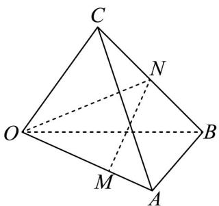

> [!faq]- 《专题1.2 空间向量基本定理（高效培优讲义）》官方解析
>
> > [!success]- **【答案】** C
>
> > [!note]- **【分析】**
> > 根据几何关系，结合向量的线性运算，即可求解·
>
> > [!note]- **【解析】**
> > 连接 ON，因为 $\overline{BN} = \overline{NC}$ ，所以 $\overline{ON} = \frac{1}{2} (\overline{OB} + \overline{OC})$
> >
> > 因为 $\overline{OM} = 2MA$ ，所以 $\overline{OM} = \frac{2}{3}OA$
> >
> > 所以 $MN = ON - OM = \frac{1}{2} \left( OB + OC \right) - \frac{2}{3} OA = -\frac{2}{3} a + \frac{1}{2} b + \frac{1}{2} c$
> >
> > 故选：C.
> >
> > 
